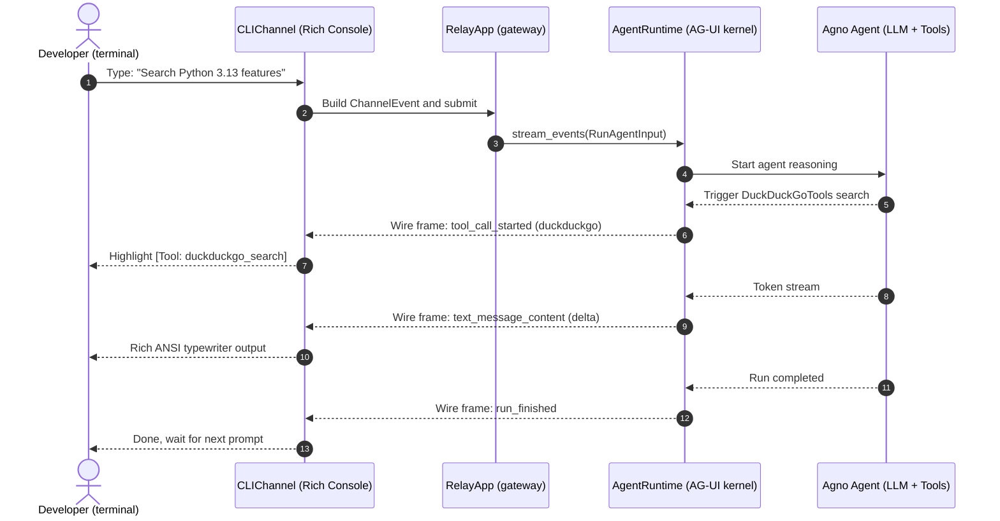

# 01. Pure CLI Agent

The fastest way into `agno-harness`. **No public IP, no frontend, no bot credentials.** A few lines of code and you have a typewriter stream in the local terminal.

---

## 1. Architecture and sequence



- **Single responsibility**: `AgentRuntime` compiles agent reasoning into an AG-UI event stream; `RelayApp` mounts `CLIChannel` and renders it to the console.
- **Ready to use**: terminal Markdown, live typewriter output, and slash commands such as `/reset`.

---

## 2. Full example

Create `my_cli_agent.py`:

```python
"""my_cli_agent.py — minimal terminal agent"""
import os
from agno.agent import Agent
from agno.models.openai import OpenAIChat
from agno.tools.duckduckgo import DuckDuckGoTools
from agno_harness import (
    AgentRuntime,
    CLIChannel,
    RelayApp,
    RelayConfig,
    setup_relay_logging,
)

# 1. Colored terminal logs
setup_relay_logging(level="INFO")

# 2. Standard Agno Agent
# Model params read AGNO_HARNESS_LLM_* only
agent = Agent(
    name="CLI Research Assistant",
    model=OpenAIChat(
        id=RelayConfig.llm_model(default="gpt-4o"),
        base_url=RelayConfig.llm_base_url() or None,
        api_key=RelayConfig.llm_api_key() or None,
    ),
    instructions=[
        "You are a research assistant running in a terminal.",
        "Use the search tool for technical questions and facts.",
        "Reply in structured Markdown. Label code fences with a language.",
    ],
    tools=[DuckDuckGoTools()],
    markdown=True,
)

# 3. Execution kernel (standard AG-UI event stream)
runtime = AgentRuntime(agent=agent)

# 4. Mount on RelayApp and add the CLI channel
relay = RelayApp(runtime=runtime)
cli_channel = CLIChannel()
relay.add_channel(cli_channel)

if __name__ == "__main__":
    import asyncio

    async def main():
        await relay.start()
        try:
            print("\nTip: type to chat; /reset clears history; Ctrl+C exits.\n")
            await cli_channel.run_interactive_loop(
                chat_id="cli-session",
                sender_id="developer",
            )
        finally:
            await relay.stop()

    asyncio.run(main())
```

---

## 3. Run it

```bash
uv run python my_cli_agent.py
```

What you should see:

1. **Typewriter stream** — each token lands in the console as it arrives.
2. **Colored tool tags** — `DuckDuckGoTools` prints `[Tool: duckduckgo_search] (args: ...)`.
3. **`/reset`** — clears the session and prints `Session context cleared. Starting fresh!`.
