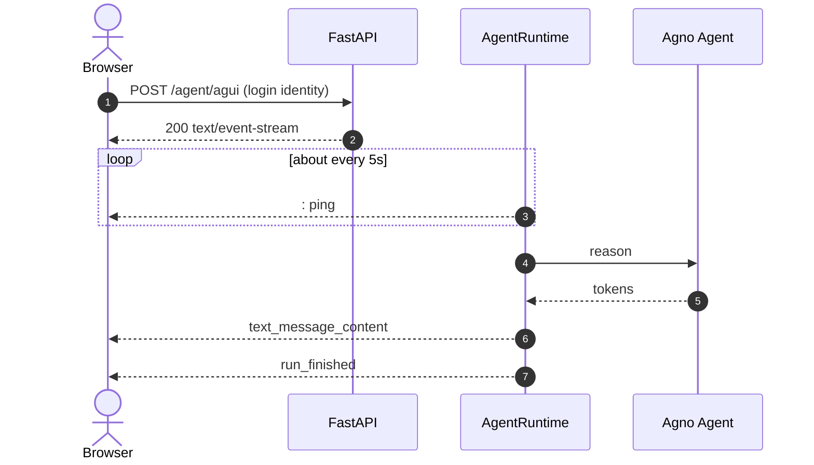

# 02. Web and FastAPI

Mount the agent on FastAPI and watch tokens arrive over SSE. This chapter **only gets the service running**. Cards, `ItemSchema`, and a todo sidebar come later.

Product shell: [Web / React](../03-clients/01-web-react/README.md).

---

## 1. Model iron rules

Compatible gateways (OpenRouter / DashScope / vLLM) use `OpenAILike`, not official-OpenAI `OpenAIChat` (`developer` role, thinking mismatch, easy 400s).

Keep `telemetry=False`: Agno waits on a telemetry POST after the run and the SSE looks hung at the end.

Set `num_history_runs=100` so the compressor owns memory. `0` or `None` causes amnesia: [compression 01](../02-interactions/04-compression-and-sealing/01-why-and-num-history.md).

```python
from agno.models.openai.like import OpenAILike

agent = Agent(
    model=OpenAILike(
        id=RelayConfig.llm_model(default="qwen-plus"),
        api_key=RelayConfig.llm_api_key() or None,
        base_url=RelayConfig.llm_base_url() or None,
    ),
    telemetry=False,
    add_history_to_context=True,
    num_history_runs=100,
    markdown=True,
)
```

---

## 2. Sequence



After mount you have `POST /agent/agui`, `GET /agent/threads`, and `GET /agent/threads/{id}/frames` (once storage is on). Long-run `/attach`: [Web 04](../03-clients/01-web-react/04-attach-and-longrun.md).

Read identity from the login (cookie / session / `request.state`), not `userId` in JSON. A missing or foreign thread is `404`. See [02 FastAPI](../01-foundations/02-fastapi-integration.md).

---

## 3. Minimal service

`web_agent_server.py`:

```python
from fastapi import FastAPI, Request
from fastapi.responses import HTMLResponse
import uvicorn

from agno.agent import Agent
from agno.models.openai.like import OpenAILike
from agno_harness import AgentRuntime, RelayApp, RelayConfig, WebChannel, setup_relay_logging

setup_relay_logging(level="INFO")

agent = Agent(
    name="assistant",
    model=OpenAILike(
        id=RelayConfig.llm_model(default="qwen-plus"),
        api_key=RelayConfig.llm_api_key() or None,
        base_url=RelayConfig.llm_base_url() or None,
    ),
    instructions="Answer in short Markdown.",
    telemetry=False,
    add_history_to_context=True,
    num_history_runs=100,
    markdown=True,
)
runtime = AgentRuntime(agent=agent)
relay = RelayApp(runtime=runtime)
relay.add_channel(WebChannel())

app = FastAPI(lifespan=relay.lifespan)

def resolve_user_id(request: Request) -> str | None:
    return request.headers.get("X-User-Id") or "local-dev"

app.include_router(relay.get_router(prefix="/agent", resolve_user_id=resolve_user_id))


@app.get("/", response_class=HTMLResponse)
async def index():
    return """
    <!DOCTYPE html>
    <html><body style="font-family:sans-serif;max-width:640px;margin:40px auto">
      <h2>SSE typewriter</h2>
      <pre id="log" style="height:280px;overflow:auto;border:1px solid #ccc;padding:12px"></pre>
      <input id="q" value="Describe agno-harness in three sentences" style="width:70%" />
      <button onclick="send()">Send</button>
      <script>
        async function send() {
          const text = document.getElementById('q').value;
          const log = document.getElementById('log');
          log.textContent += "\\n\\nYou: " + text + "\\nAssistant: ";
          const resp = await fetch('/agent/agui', {
            method: 'POST',
            headers: {'Content-Type':'application/json','X-User-Id':'local-dev'},
            body: JSON.stringify({
              threadId: 'web-1', runId: 'run-' + Date.now(),
              messages: [{id:'m1', role:'user', content: text}],
              state: {}, context: [], tools: [], forwardedProps: {}
            })
          });
          const reader = resp.body.getReader();
          const dec = new TextDecoder();
          while (true) {
            const {done, value} = await reader.read();
            if (done) break;
            for (const line of dec.decode(value).split('\\n')) {
              if (!line.startsWith('data: ')) continue;
              try {
                const ev = JSON.parse(line.slice(6));
                if (ev.event === 'text_message_content' || ev.type === 'TEXT_MESSAGE_CONTENT')
                  log.textContent += (ev.delta || ev.content || '');
              } catch (e) {}
            }
            log.scrollTop = log.scrollHeight;
          }
        }
      </script>
    </body></html>
    """

if __name__ == "__main__":
    uvicorn.run("web_agent_server:app", host="0.0.0.0", port=8000, reload=True)
```

```bash
uv run python web_agent_server.py
```

Open `http://localhost:8000` and send. Tokens arrive in chunks. DevTools Network shows `: ping`.

This page is **not** the product shell. Resume, sidebar, and stick-to-bottom are the Web five steps.

---

## 4. After this works

| Next | Read |
| --- | --- |
| Product frontend | [Web five steps](../03-clients/01-web-react/README.md) |
| Assemble the agent (tools, hooks, parsers) | [07 Writing an agent](../01-foundations/07-writing-an-agent.md) |
| Cards | [01 Class-First](../02-interactions/01-class-first-cards.md) |
| Todos / long docs / compression | [03 Todos](../02-interactions/03-todo/README.md) · [08 Artifacts](../02-interactions/08-streaming-artifacts.md) · [04 Compression](../02-interactions/04-compression-and-sealing/README.md) |
