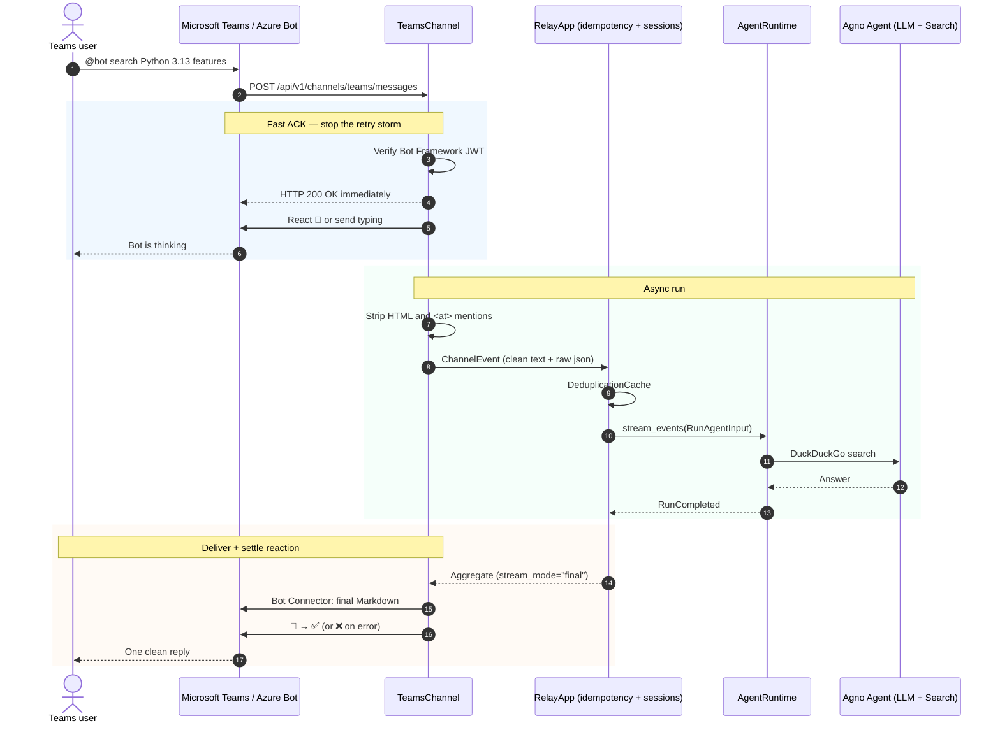

# 03. Microsoft Teams Bot Agent

A minimal Teams bot: **Agent + DuckDuckGo only**. No extra cards or callbacks. Wizard → live chat.

---

## 1. Onboarding wizard

```bash
uv run agno-harness teams onboard
```

Teams has no QR code. The wizard runs the Teams Developer CLI (`teams app create`) and prints an install URL. Open that link in a browser.

Install the CLI once: `npm install -g @microsoft/teams.cli`, then `teams login --device-code`. Plain `teams login` opens a browser and fails with AADSTS70007. If `teams status` says you are logged in but `TDP: not connected`, run `teams logout`, then `teams login --device-code`.

1. **Create** — `teams app create` registers a Teams-managed bot. No Azure subscription.
2. **Install URL** — the terminal prints `https://teams.microsoft.com/l/app/...`. Open it and add the bot.
3. **Credentials** — the terminal prints env lines and does not write a file. Copy them into `.env`:

   ```env
   AGNO_HARNESS_TEAMS_APP_ID=xxxxxxxx-xxxx-xxxx-xxxx-xxxxxxxxxxxx
   AGNO_HARNESS_TEAMS_APP_PASSWORD=your_azure_client_secret
   # Single-tenant bots: set the tenant. Multi-tenant bots: leave empty.
   AGNO_HARNESS_TEAMS_TENANT_ID=
   ```

   Then `agno-harness teams doctor` prints the install link and checks whether the bot's messaging callback is set.

Scaffold the agent separately with `agno-harness init . --channel teams`. `teams onboard` does not ask for a project directory.

---

## 2. Architecture and sequence



What the base already handles:

1. **JWT check** — Bot Framework bearer token, audience = App ID. Missing token is HTTP 401.
2. **HTML cleanup** — `<p>`, `<div>`, `<br>` become Markdown.
3. **Mention strip** — `<at>BotName</at>` never reaches the model as a prompt token.
4. **Rate-limit safety** — default `stream_mode="final"`, never edit per token.

---

## 3. Minimal server

Create `teams_agent_server.py`:

```python
"""teams_agent_server.py — minimal Teams bot"""
from fastapi import FastAPI
import uvicorn

from agno.agent import Agent
from agno.models.openai import OpenAIChat
from agno.tools.duckduckgo import DuckDuckGoTools
from agno_harness import (
    AgentRuntime,
    RelayApp,
    RelayConfig,
    TeamsChannel,
    setup_relay_logging,
)

setup_relay_logging(level="INFO")

agent = Agent(
    name="Teams Assistant",
    model=OpenAIChat(
        id=RelayConfig.llm_model(default="gpt-4o"),
        base_url=RelayConfig.llm_base_url() or None,
        api_key=RelayConfig.llm_api_key() or None,
    ),
    instructions=[
        "You are an office assistant in Microsoft Teams.",
        "Use DuckDuckGo for current facts.",
        "Reply in concise Markdown.",
    ],
    tools=[DuckDuckGoTools()],
    markdown=True,
)

runtime = AgentRuntime(agent=agent)

# enable_deduplication=True: drop Teams retries while search is still running
relay = RelayApp(runtime=runtime, enable_deduplication=True)

# Zero-arg init reads AGNO_HARNESS_TEAMS_APP_ID / AGNO_HARNESS_TEAMS_APP_PASSWORD.
# Group chats are mention-only. Pass chime_in_policy= to change that.
relay.add_channel(TeamsChannel())

app = FastAPI(title="Teams Agent Service", lifespan=relay.lifespan)

# No router prefix: Azure Messaging endpoint is POST /api/v1/channels/teams/messages.
# allow_anonymous applies to AG-UI routes. The Teams webhook checks the Bot Framework JWT itself.
app.include_router(relay.get_router(allow_anonymous=True))

if __name__ == "__main__":
    uvicorn.run("teams_agent_server:app", host="0.0.0.0", port=8000)
```

---

## 4. Tunnel and end-to-end

### A. Expose localhost

```bash
ngrok http 8000
# e.g. https://abc1234.ngrok-free.app
```

### B. Azure Messaging endpoint

Azure Portal → your Azure Bot → **Configuration** → Messaging endpoint:

```
https://abc1234.ngrok-free.app/api/v1/channels/teams/messages
```

### C. Talk to the bot

1. Open Teams, DM the bot or `@` it in a group.
2. Ask: “Search the latest Python 3.13 features.”
3. Console should show a `[TEAMS]` badge, cleaned HTML, and `duckduckgo_search`.
4. The chat gets one Markdown reply — no 429, no broken formatting.
