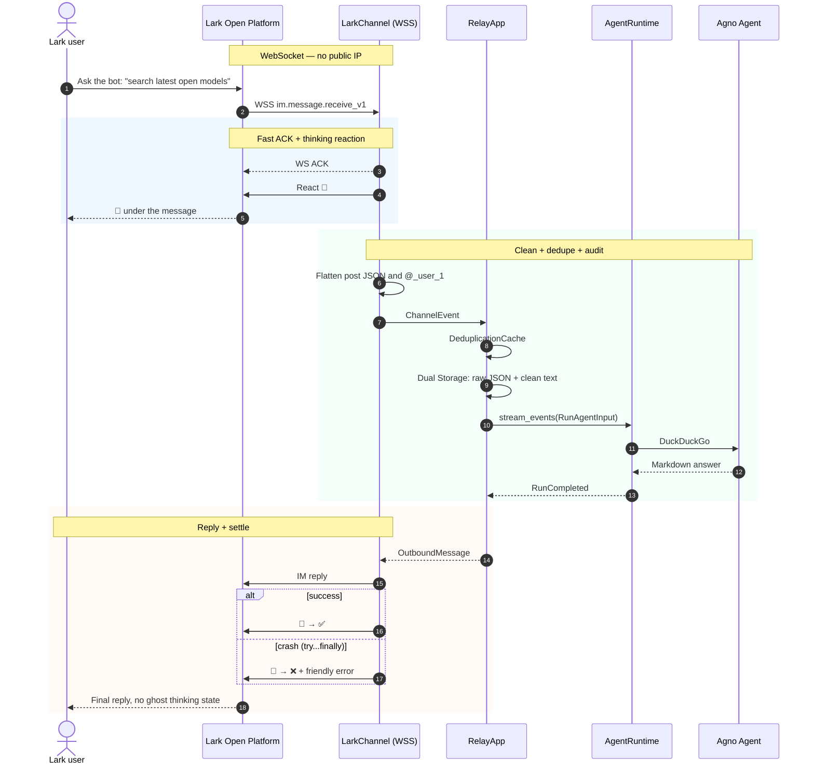

# 04. Lark / Feishu Bot Agent

A minimal Lark bot: **Agent + DuckDuckGo**, plus a **WebSocket long connection** so you do not need a public IP.

---

## 1. Onboarding wizard

```bash
uv run agno-harness lark onboard
```

The wizard prints:

1. **Open Platform create-app** — terminal QR or a browser link.
2. **Least privilege**:
   - `im:message.group_at_msg:readonly` — group messages that `@` the bot.
   - `im:message.p2p_msg:readonly` — DMs.
3. **Event to subscribe**: `im.message.receive_v1`.
4. **Secrets** written to `.env`:

   ```env
   AGNO_HARNESS_LARK_APP_ID=cli_xxxxxxxxxxxx
   AGNO_HARNESS_LARK_APP_SECRET=xxxxxxxxxxxxxxxxxxxxxxxx
   ```

---

## 2. Architecture and sequence



What the base already handles:

1. **No public IP** — local process receives cloud events over WebSocket.
2. **Fast ACK** — cuts timeout retries.
3. **Reaction state machine** — `👀` on receive, `✅` on success, `❌` on crash (`try...finally`).
4. **Post + mention cleanup** — nested `post` JSON and `@_user_1` become Markdown.
5. **Dual Storage** — raw Lark JSON and cleaned Markdown both persist.

---

## 3. Minimal bot

Create `lark_agent_bot.py`:

```python
"""lark_agent_bot.py — WebSocket Lark bot, no public IP"""
import asyncio

from agno.agent import Agent
from agno.models.openai import OpenAIChat
from agno.tools.duckduckgo import DuckDuckGoTools
from agno_harness import (
    AgentRuntime,
    LarkChannel,
    RelayApp,
    RelayConfig,
    setup_relay_logging,
)

setup_relay_logging(level="INFO")

agent = Agent(
    name="Lark Assistant",
    model=OpenAIChat(
        id=RelayConfig.llm_model(default="gpt-4o"),
        base_url=RelayConfig.llm_base_url() or None,
        api_key=RelayConfig.llm_api_key() or None,
    ),
    instructions=[
        "You are an office assistant in Lark.",
        "Use DuckDuckGo for current facts.",
        "Reply in concise Markdown.",
    ],
    tools=[DuckDuckGoTools()],
    markdown=True,
)

runtime = AgentRuntime(agent=agent)
relay = RelayApp(runtime=runtime, enable_deduplication=True)

# Zero-arg init reads AGNO_HARNESS_LARK_APP_ID / AGNO_HARNESS_LARK_APP_SECRET
lark_channel = LarkChannel(use_websocket=True)
relay.add_channel(lark_channel)


if __name__ == "__main__":
    async def main():
        print("Connecting to Lark over WebSocket...")
        await relay.start()
        print("Connected. DM the bot or @ it in a group.\n")
        try:
            while True:
                await asyncio.sleep(3600)
        finally:
            await relay.stop()

    asyncio.run(main())
```

---

## 4. Run it

```bash
uv run python lark_agent_bot.py
```

1. Console prints that the long connection is up — no firewall ports to open.
2. **DM**: ask “what are the latest open-source models?”
   - `👀` appears immediately.
   - Console shows `[LARK]` and the search tool.
   - You get a Markdown answer; reaction becomes `✅`.
3. **Group**: `@bot hello` replies; messages that do not mention the bot stay silent.
