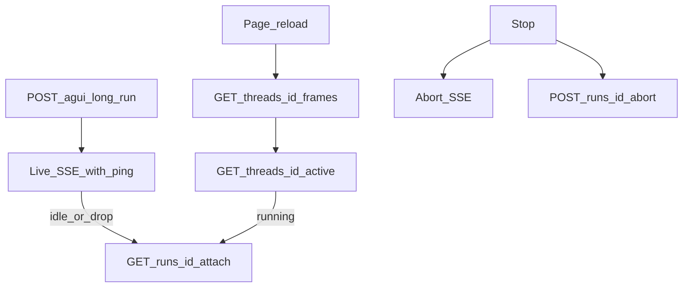

# 04. Refresh-and-resume: attach / cursor / ping / idle

Read `X-Agui-Resume` from the response. Do not guess. `404` on `/runs/*` means `long_runs` is not mounted. Long jobs use `POST /agui?long-run=1` (alias `?detach=1`). Storage duties → [persistence](../../01-foundations/05-persistence-and-longruns/README.md).

| | `X-Agui-Resume: none` | `history` | `live` |
| --- | --- | --- | --- |
| Tab close / crash / drop | Connection dies, the run dies | Run continues; you only see written frames | Run continues; `GET /runs/{id}/attach?after=` picks up mid-sentence |
| Stop | Abort this HTTP | Abort the connection + `POST /runs/{id}/abort` | Same |
| Refresh | Whatever already landed | `/frames` up to the write point | `/frames` + attach `?after=` |
| Routes | No `/runs/*` | Yes | Yes |

Closing a tab or crashing is **not** stop. `POST /runs/{id}/abort` is only Stop. `AbortController.abort()` stops the connection; `LongRunManager.abort()` stops the run.

## 1. Call it attach, not stream

Canonical: `GET /runs/{runId}/attach?after=`

| Name | Meaning | Client use |
| --- | --- | --- |
| **attach** | Rejoin an in-flight / just-finished run over SSE | **The only path to write** |
| `/runs/{id}/stream` | Deprecated, same as `/attach` | Do not write new code against it |
| `/threads/{id}/frames` | Replay stored display frames | Open / refresh history; **not** live |
| `/threads/{id}/messages` | Agno session (lossy) | **Not** the UI transcript |

Never mix the two cursors:

| Cursor | Shape | Only for |
| --- | --- | --- |
| attach / SSE `id:` | One-run log offset (e.g. `000000000012`) | `GET /runs/{id}/attach?after=` or `Last-Event-ID` |
| frames | `{runId}:{paddedOffset}` | `GET /threads/{id}/frames?after=` |

## 2. The product must do this

### A. Local session state

```ts
type SessionCursor = {
  threadId: string;
  runId?: string;
  lastEventId?: string;  // last successfully reduced SSE id: (attach cursor)
};
```

- Every SSE frame with `id:` → update `lastEventId`.
- Run **finished / user Stop** → clear `runId`.
- “Connection died but the job may still be alive” → **keep** `runId` + `lastEventId`.

### B. Send

```ts
await postSse(`${API}/agui?long-run=1`, runAgentInput, {
  signal: abortController.signal,
  onFrame: (frame) => {
    if (frame.id) lastEventId = frame.id;
    applyEvent(JSON.parse(frame.data));
  },
});
```

When `resumeMode === "none"`, do not send `long-run` and do not idle re-attach.

### C. Wire keepalive + idle re-attach

From second 0 the server sends an SSE comment `: ping\n\n` about every **5s** (not a `data:` frame, but it **counts as bytes**).

The SSE reader **must**:

1. Any network byte (including a `:`-only comment) → reset idle.
2. After seeing a heartbeat, idle ≈ **3× the interval** (about 6–30s; ~15s if no heartbeat seen).
3. Timeout → a recognizable `AbortError` (e.g. `cause: "sse-idle"`). **Not** user Stop.
4. If `resumeMode !== "none"` and it is not Stop → immediately `GET /runs/${runId}/attach?after=${lastEventId}` into the same reducer.

Stop:

```ts
stopping = true;
abortController.abort();
await fetch(`${API}/runs/${runId}/abort`, { method: "POST" });
```

**Wrong:** treat “no AG-UI event” as a dead connection; abort the run on idle; attach with a `/frames` id.

### D. Refresh sequence

```text
1. Read resumeMode
2. Read localStorage session
3. GET /threads/{threadId}/frames
4. Same applyEvent into the transcript
5. GET /threads/{threadId}/active
6. If running: GET /runs/{runId}/attach?after={lastEventId}
7. Before attach, set currentId back to assistant-${runId}
```

Opening a finished thread: stop after step 4. Idle reconnect is step 6 without a full reload.



### E. Sidebar merge

`GET /threads` `runCount` is how many times a human spoke; ignore `messageCount`. If the active thread is not on disk yet, pin an optimistic row (see [02](02-thread-shell.md)).

### F. Checklist

- [ ] New code only requests `/attach`
- [ ] Frame ids and attach ids live in separate stores and never cross
- [ ] Live / frames / attach share one `applyEvent`
- [ ] `long-run=1` is bound to `resumeMode`
- [ ] Comments are keepalive; idle → attach, not abort run
- [ ] Stop = drop the connection + `POST .../abort`
- [ ] Refresh: frames → active → attach; clear `runId` when done
- [ ] Sidebar uses `runCount`
- [ ] After the first send, a refresh does not drop that thread

Crash: no abort, no `beforeunload`. Next open uses the localStorage cursor: `/frames` then attach. You lose progress if resume is `none`, the worker died, or the user cleared site data.

Product rules:

1. One open run per thread. `start` is idempotent for the same `runId`. A fresh `newId("run")` does **not** stop an already long-running job. Check `/active` before sending.
2. Do not mix the two `after` values.
3. The archive folds consecutive content deltas into one frame.
4. `unrecordable`: a log write failure does not kill the stream, but the cursor stops. Do not promise resume.
5. A running job whose worker heartbeat expired fails attach. `404` with a transcript already on screen = a zombie `runId`; clear it.
6. `RUN_STARTED` for the same `runId` replaces that assistant. Reconnect with `after=`.
7. `RUN_STARTED.rawEvent.user_input` and `/active.input` carry the prompt. If the list has no user bubble yet, prepend one.
8. `STEP_*` is intentionally not restored on replay.
9. Two tabs share attach only if they share `threadId+runId`. Two `runId`s are two runs.
10. After replay, attach must hang `currentId` back on `assistant-${runId}` or later `TEXT_*` is dropped.
11. On `none`, a dropped connection may have no terminal event — set `isStreaming=false` yourself.
12. Cross-process follow needs Redis. `memory://` cannot follow mid-sentence after a worker swap.
13. After Stop the server writes `CUSTOM run.cancelled` (`reason: "user_aborted"`). Paint “generation stopped”, not a red error card and not “completed”.

Next: [05 Close-out](05-hitl-cards-devtools.md).
