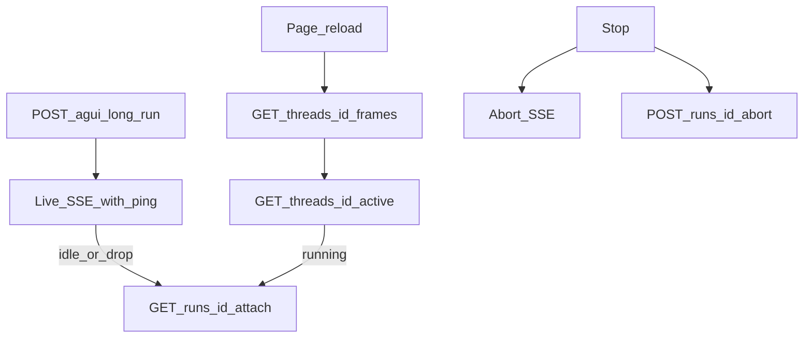

# 完整 Agent UI

从没见过这套协议也能做出完整产品壳。参考实现：[`examples/demo/frontend/`](../examples/demo/frontend/)。Demo **没有**做完下面每一条；已知缺口见 [demo-issues.md](demo-issues.md)。

协议事实（这仓库保证什么）和产品层必须自己做，分开写。每节：**对的做法 / 常见错法 / 抄哪个文件**。

**长任务 / 刷新续写 / SSE keepalive：** 先读 [§4.2 前端实现指南](#42-前端实现指南产品必须照做)（`/attach`、idle re-attach、`runCount`）。存储层细节 → [persistence.md](persistence.md)。

HITL → [hitl.md](hitl.md)。动态 Todo 与常驻侧栏 → [todo-workflow.md](todo-workflow.md)。卡片细节 → [cards.md](cards.md)。Debug 面板复制 → [`examples/frontend-kit/agui-devtools/`](../examples/frontend-kit/agui-devtools/)。

## 五条铁律

1. **一个 `applyEvent`，live 和 replay 共用。** 禁止从 Agno `GET /threads/{id}/messages` 重建再自己分组。
2. **只渲染 `body.order[]`。** slot 在元素**打开**时 push。工具出现在 markdown 下面 = 客户端重排了，不是 runtime 的错。
3. **历史走 `/frames`，不是 `/messages`。** `/messages` 是给模型的lossy session。
4. **只有用户往上滚才脱离吸附。** 内容变高导致的 `scrollTop` 变不算脱离。
5. **Stop ≠ 断线。** 关 tab / 闪退 / 断网只是不看了。`POST /runs/{id}/abort` 只对应 Stop（以及产品明确「丢掉这次任务」）。

协议不提供、产品自己做、不要假装 toolbox 有：消息编辑 / 重新生成、会话分叉、附件多模态、语音、虚拟列表、每 token 性能优化。

---

## 1. 产品外壳

### 1.1 Thread 标题：函数 + CUSTOM

**不新增 HTTP 路由。** 产品调 runtime 函数；默认用 post-run hook 在首轮成功结束后起名，并往同一条 SSE 里 yield `CUSTOM thread.title`（落在 `RUN_FINISHED` 之前）。前端第二轮若要再起名，在这次 `send` 的 `forwardedProps.refreshTitle = true`。

```python
title = await runtime.generate_thread_title(thread_id, user_id=..., max_turns=1)
runtime.on_post_run(make_thread_title_hook(runtime))
```

| 点 | 约定 |
| --- | --- |
| 何时自动跑 | 本 thread **还没有**已保存标题，且本 run 成功。失败的 run 不起名。 |
| 再触发 | `forwardedProps.refreshTitle === true` 时强制再生成（典型：第二轮结束后）。 |
| 模型输入 | 第一轮：`scope.user_text` + completion 文本（post-run 时 session 可能还没 flush）。再触发：session 最近 `max_turns` 轮。 |
| 落盘 | Agno session `session_data["session_name"]`（`rename_session` / `upsert_session`）。 |
| `GET /threads` | 每条 `{ threadId, title, runCount, messageCount, updatedAt }`。`title` **先读已保存标题**（`session_title`），没有才回退「首条用户消息[:40]」。`runCount` = 人说了几句（Agno runs 数）。`messageCount` **已废弃，恒为 0**（旧客户端兼容）。无 run 的 session 仍不进列表。列表路径不做 transcript 重建。 |
| 事件 | `CUSTOM` `name="thread.title"` `value={ threadId, title }`。CustomEvents 模块会归档，刷新后 reducer 还能看到。 |
| 失败 | 起名失败不影响主 run；侧栏保持「新任务」或用户消息回退。 |
| LLM | 走 `agent.model` 的一次短补全，**不要** `agent.arun()`（会污染 session / 工具）。提示词：侧栏短标题，不要解释。 |

前端（产品必须做；demo 侧栏/动画见 demo-issues，本次未改）：

- 新对话乐观行：**「新任务」**，禁止闪 UUID。
- **首轮未落盘时的前端乐观缓存（核心规范）**：
  - **根因**：Agno 架构下，`AgentSession` 只有在**首个 run 完整执行完毕后**才会事务提交写入数据库。在首个 run 运行期间（模型思考、打工具、吐字中），后端数据库根本没有这条记录，`GET /threads` 自然不包含此会话（无 run 的 session 亦不进列表）。
  - **现象**：用户新建对话发了第一句，模型正在回答，用户手滑刷新页面，若前端纯依赖 `GET /threads`，当前会话在侧栏凭空消失，极易导致状态丢失。
  - **解法**：
    1. **发问即建档**：用户在新建 thread 发送第一条消息时，前端立即在本地状态（或 `localStorage`）登记此乐观项：`{ threadId, title: "新任务", runCount: 1, messageCount: 0, updatedAt: Date.now() }`。
    2. **侧栏拉取合并 (Merge)**：`GET /threads` 获取服务端列表后，若当前激活的 `threadId` 仍有消息/未完结且不在服务端列表中，自动将其置顶合并显示。
    3. **首轮结束后无缝接管**：首轮 run 成功结束（或收到 `thread.title` 事件后下一轮 `GET /threads` 返回了该记录），服务端真实数据自然替换乐观项。
- reducer：`thread.title` → 更新当前 thread 的 title；同一行 crossfade，不要 remount。
- 第二轮后再命名：`chat.send(text, { forwardedProps: { reasoning, refreshTitle: true } })`。
- 没有挂 hook 的后端：行为与现在相同（列表仍是首条用户消息）。

没有 `POST /threads/{id}/title`。前端再触发 = 下一次 run 带 `refreshTitle`。

**错法：** 侧栏 `title || threadId`；为起名再打一条 HTTP。

### 1.2 Thread 列表展示最佳实践（状态感知、未读水位与跨页面唤回）

Agent 与传统聊天（微信 / Slack）本质不同：用户发起重度任务（调研、代码生成、多步工具编排）后，**往往会切走去做别的事**（看后台数据、回邮件、切到其他浏览器标签页）。一个专业的 Agent 侧栏必须具备高水准的状态感知能力，但又绝不能产生视觉噪音与泛滥干扰。

#### A. 四阶状态模型与视觉感知

侧栏每个 Thread 应处于且仅处于以下 4 种状态之一：

```
       [用户触发长任务]
             ↓
        ┌─────────┐     HITL 挂起 / 权限确认
        │ running ├─────────────────────────┐
        └────┬────┘                         ↓
             │ 正常完结                 ┌────────┐
             ↓                          │ paused │
     ┌───────────────┐                  └───┬────┘
     │ just_finished │                      │ 用户确认 / 恢复
     └───────┬───────┘                      ↓
             │ 点进查阅 / 时效衰减      ┌────────┐
             └─────────────────────────>│  idle  │
                                        └────────┘
```

| 状态 | 触发时机 | 推荐视觉表现 | 核心产品心智 |
| --- | --- | --- | --- |
| **`running`** | 正在流式吐字、调用工具或后台执行 | 浅蓝脉冲点 / Spinning Loader | **放心离开**：明确告知后台正在勤奋工作，用户无需驻留当前屏。 |
| **`paused`** | 命中 HITL（确认 / 输入 / 表单） | **醒目琥珀色黄点 / AlertCircle 徽章** | **最高优先级唤回**：流程停在此处等待人类决策，不处理无法继续推进。 |
| **`just_finished`** | 任务刚跑完且用户未读（在时效窗口内） | 清脆利落的绿勾（`✓` / `CheckCircle2`） | **成果就绪**：提示用户“刚才交代的事情已办好，可点进查看”。 |
| **`idle`** | 已查阅、无后台任务或时效已衰减 | 默认纯净图标 / 标题 | **清爽归档**：界面恢复克制素雅，不带任何残留红点或绿勾。 |

> **关于 `runCount`（运行次数）徽章的说明（可选设计）：**
>
> 许多团队误以为必须在列表右侧常驻显示数字（如 `1`、`3`）。**在多数现代极简或通用 Agent 场景中，`runCount` 是完全可选的**。
> - **极简/现代产品**：常态（`idle`）下右侧直接留白，或仅展示轻量相对时间（如“10m 前”），只在 `running` / `paused` / `just_finished` 时出状态图标，已读后立刻恢复干净，不留数字视觉负担。
> - **客服 / 工单 / 多轮统计场景**：才把 `runCount` 渲染为右侧浅灰色小数字（`tabular-nums text-muted-foreground`），提示历史轮数。

---

#### B. 防骚扰三大体验护栏（杜绝红绿泛滥）

若只做状态判断而不加约束，侧栏很快会沦为“满屏绿勾、关不掉的红点”。前端必须严格实现以下三道体验护栏：

1. **点击即焚（View on Open）：**
   - 用户一旦在侧栏点击该 Thread，前端立即在本地写入该会话的阅读时间戳（`lastViewedAt = Date.now()`）。
   - `just_finished` 的绿勾瞬间消失，无缝回退到 `idle`。绝不需要用户手动去点什么“标记为已读”按钮。
2. **时效衰减（Time-window Decay）：**
   - 完结绿勾只服务于“新鲜感”。任务哪怕完结了但用户一直没看，只要更新时间超过设定的衰减窗口（**建议 `MAX_ALERT_AGE = 2 小时`**，上限不超 4 小时），自动衰减为 `idle`。
   - 避免昨天或前天的陈旧任务在侧栏永久挂着小绿勾。
3. **换设备 / 跨端静默（Zero Clutter on Cold Start）：**
   - 当用户在全新电脑、新手机、或无痕模式登录系统时，由于本地 `lastViewedAt` 为空，如果不做时效衰减，满屏历史会话全是一排刺眼的绿勾。
   - 依赖上面的“时效衰减机制”，所有早于 2 小时的历史会话全部静默为 `idle`；新登录用户看到的列表整洁如新，只有真正正在跑或刚刚完成的任务才带高亮。

---

#### C. 扫描与轮询策略：是不是每几分钟扫一次 threads？

**绝不要无脑 `setInterval(fetchThreads, 3000)`！** 盲目高频轮询浪费服务端 CPU，还会打乱前端动画与焦点。建议采用**「事件驱动 + 聚焦唤醒 + 伴随式自适应短轮询」**的三级自适应机制：

```
                    ┌─────────────────────────┐
                    │ 是否有未完结的活动任务？ │
                    └────────────┬────────────┘
                         是      │      否
              ┌──────────────────┴──────────────────┐
              ↓                                     ↓
    【自适应短轮询】                        【全静止休眠】
   10s ~ 15s 伴随轮询                     完全停止轮询 / 5min 极低频
 (随时捕获后台进度与 HITL)                 仅监听聚焦唤醒事件
              │                                     │
              └───────────────┬─────────────────────┘
                              │ 用户切回网页 / 窗口重新聚焦
                              ↓
                    【focus 唤醒刷新】
                   立即执行一次 refreshThreads()
```

1. **第 1 级：当前激活会话（0 轮询，纯事件驱动）：**
   - 用户正在看的会话挂着 live SSE 或 `/attach` 长连接。
   - 当收到 `CUSTOM: thread.title`、`CUSTOM: run.paused` 或 `RUN_FINISHED` 终态事件时，**瞬时精准调用一次** `refreshThreads()` 更新标题与状态，无需任何轮询。
2. **第 2 级：切回窗口瞬时唤醒（Focus Triggered）：**
   - 用户在别的 Tab 逛完切回本页面，或笔记本开盖唤醒。
   - 监听 `window.addEventListener("focus", ...)` 或 `document.addEventListener("visibilitychange", ...)`：当页面从后台变前台时，**立即触发单次拉取**，用户一回来看到的就是最新状态。
3. **第 3 级：伴随式自适应短轮询（Adaptive Background Polling）：**
   - **开启条件**：仅当前端本地状态（或 Store）获知有后台会话尚未完结时（如 `runningThreadsCount > 0`）。
   - **轮询频次**：以 `10s ~ 15s` 间隔轻量拉取。
   - **休眠降级**：一旦侧栏所有 Thread 全部归于终态（无 running，无 paused），**立即停掉短轮询计时器**，退避为 3~5 分钟心跳，或者完全不主动扫，静候用户动作或切回唤醒。

---

#### D. 跨页面与离开时的 HITL 待办提醒机制

> **痛点场景：** 用户在 `/agent` 发起代码分析或数据写入，随后切到了系统的【数据看板】或【系统设置】页面（非 Agent 页面）；或者切到了别的 Chrome Tab 甚至最小化了浏览器。此时 Agent 运行到了关键节点（如执行高危 SQL 确认、或者输入缺漏参数，即 `requires_confirmation=True` / `requires_user_input=True`），如何唤回用户？

必须从**页面内全局感知**与**系统级跨端通知**两层建立唤回体系：

##### 1. 全局 Layout 状态提升（跨页面感知）
不要把 Agent 状态只放在 `/agent` 路由内部组件里！在全站的 Root Layout 中挂载全局 Store（Zustand / Redux / Context，如 `AgentTaskProvider`）：
- **顶栏导航角标（Navbar Badge）**：
  - 顶栏的 "AI 助手" 或导航栏图标上，出现醒目的琥珀色脉冲呼吸灯（`paused`）或蓝灯（`running`）。
  - 有 HITL 待决策时，显示红黄角标数字（如 `1`）。
- **全局浮动 Banner / Toast 提示（Global Toast）**：
  - 当全局监控探查到后台某一 Thread 变为 `paused` 时，页面右上角滑出全局卡片：
    ```
    ┌─────────────────────────────────────────────────────────────┐
    │ ⚠️ Agent 任务需要您的确认                                    │
    │ 任务「生产环境数据迁移」已生成 SQL，需要您授权执行         │
    │                                     [ 忽略 ]   [ 立即处理 ] │
    └─────────────────────────────────────────────────────────────┘
    ```
  - 用户在任一业务页面点击 `[ 立即处理 ]`，直接通过路由导航到对应会话：`router.push(`/chat?threadId=${t.threadId}`)`，直达交互界面。

##### 2. 离页与系统级桌面唤回（用户切出浏览器）
当用户切到了其他标签页、或把浏览器最小化时，DOM 界面上的 Banner 无法被直接看见，启用以下离页唤回方案：
- **动态浏览器标题（Document Title）与 Favicon 闪烁**：
  - 当检测到 `document.visibilityState === "hidden"` 且有任务进入 `paused` 时：
    ```ts
    document.title = `⚠️ (1) 待确认 - 任务「${title}」| 平台名称`;
    // 可选：将 favicon 切换为带红点的告警图标
    ```
  - 当用户切回网页（`visibilitychange` 变为 `visible`）时，自动恢复原标题。
- **HTML5 Web Notification（系统级桌面弹窗通知）**：
  - 任务耗时较长时，引导用户授予系统通知权限（`Notification.requestPermission()`）。
  - 当检测到 HITL 暂停或长任务完成，且用户当前未聚焦页面时发射系统通知：
    ```ts
    if (Notification.permission === "granted" && document.visibilityState === "hidden") {
      const notification = new Notification("Agent 任务等待您的确认", {
        body: `任务「${thread.title || "未命名任务"}」正在等待确认操作，点击返回处理。`,
        icon: "/agent-logo.png",
        tag: `hitl-${thread.threadId}`, // 同一 thread 幂等防重复弹
      });
      notification.onclick = () => {
        window.focus();
        router.push(`/chat?threadId=${thread.threadId}`);
        notification.close();
      };
    }
    ```

---

#### E. 前端状态判定纯函数与开箱即用代码

前端状态判定应收敛为一个纯函数（Pure Resolver），输入 `ThreadSummary` 与本地阅读水位，输出确定性的四态：

```ts
export type ThreadDisplayStatus = "running" | "paused" | "just_finished" | "idle";

const MAX_ALERT_AGE_MS = 2 * 60 * 60 * 1000; // 2 小时时效衰减

export function resolveThreadStatus({
  thread,
  lastViewedAt,
  isActive,
  activeState,
}: {
  thread: { threadId: string; updatedAt?: number | null; status?: string };
  lastViewedAt?: number;
  isActive: boolean;
  activeState?: { isStreaming: boolean; hasPendingHitl: boolean };
}): ThreadDisplayStatus {
  // 1. 若当前正在此会话中看 live 交互，优先由前台 state 驱动
  if (isActive && activeState) {
    if (activeState.hasPendingHitl) return "paused";
    if (activeState.isStreaming) return "running";
    return "idle";
  }

  // 2. 服务端指示状态（如果有）
  if (thread.status === "paused") return "paused";
  if (thread.status === "running") return "running";

  // 3. 完结状态与时效衰减
  const updatedEpochMs = thread.updatedAt ? thread.updatedAt * 1000 : 0;
  const now = Date.now();

  // 超过衰减窗口（如 2 小时前完成的老任务），自动归入常态，绝不弹勾
  if (!updatedEpochMs || now - updatedEpochMs > MAX_ALERT_AGE_MS) {
    return "idle";
  }

  // 若处于当前激活会话，已在眼前，不展示未读勾
  if (isActive) {
    return "idle";
  }

  // 若该任务完结时间晚于用户最后点击查阅的时间，展示绿勾
  if (!lastViewedAt || updatedEpochMs > lastViewedAt) {
    return "just_finished";
  }

  return "idle";
}
```

**端侧阅读水位管理（单例 Hook）：**

```ts
const VIEWS_STORAGE_KEY = "agui:thread_views";

export function useThreadViews() {
  const getViews = (): Record<string, number> => {
    try {
      return JSON.parse(localStorage.getItem(VIEWS_STORAGE_KEY) || "{}");
    } catch {
      return {};
    }
  };

  const markThreadViewed = (threadId: string) => {
    const views = getViews();
    views[threadId] = Date.now();
    localStorage.setItem(VIEWS_STORAGE_KEY, JSON.stringify(views));
  };

  return { getViews, markThreadViewed };
}
```

**侧栏项（ThreadItem）标准渲染示例：**

```tsx
function StatusIndicator({ status }: { status: ThreadDisplayStatus }) {
  switch (status) {
    case "running":
      return <Loader2 className="size-3.5 animate-spin text-blue-500" />;
    case "paused":
      return (
        <span className="relative flex size-2.5">
          <span className="absolute inline-flex size-full animate-ping rounded-full bg-amber-400 opacity-75" />
          <span className="relative inline-flex size-2.5 rounded-full bg-amber-500" />
        </span>
      );
    case "just_finished":
      return <Check className="size-3.5 text-emerald-500" />;
    case "idle":
    default:
      return null;
  }
}

// 侧栏单项渲染
export function ThreadRow({ thread, isActive, onSelect, showRunCount = false }: ThreadRowProps) {
  const { markThreadViewed } = useThreadViews();
  const status = resolveThreadStatus({ ... });

  const handleClick = () => {
    markThreadViewed(thread.threadId); // 点击即焚：更新阅读水位，瞬间消除绿勾
    onSelect(thread.threadId);
  };

  return (
    <div onClick={handleClick} className={cn("group flex items-center gap-2 px-2 py-1.5 ...")}>
      <MessageSquare className="size-3.5 text-muted-foreground" />
      <span className="flex-1 truncate text-xs">{thread.title || "新任务"}</span>
      
      {/* 状态指示符 */}
      <StatusIndicator status={status} />

      {/* runCount 为可选展示：极简界面不渲染；客服/工单场景按需渲染 */}
      {showRunCount && status === "idle" && thread.runCount ? (
        <span className="tabular-nums text-[10px] text-muted-foreground">{thread.runCount}</span>
      ) : null}
    </div>
  );
}
```

---

### 1.3 其余外壳

- `threadId` 前端自己生成，别人猜得到。读到别人的 thread 时服务端回 `404`（假装不存在），不要当 `403`。换登录用户必须 `reset`，不能把上一人的 transcript 留在屏幕上。
- 身份跟登录走（cookie / session），不要把 `userId` 放进 `POST /agui` 的 JSON。demo 的 `X-Demo-User` 只是切换用户的玩具，不能抄进生产。
- 切 thread：abort **当前流**（连接）、`loadThread`、`stick.pin()`。切走 **不要** abort 已 long-run 的任务。
- 删当前 thread：删完 `reset`。
- Composer：Enter 发送 / Shift+Enter 换行；**`isStreaming` 或 `pendingTools.length > 0` 都要禁用新消息**（HITL 时流已经结束，只禁 streaming 会让用户再发一轮、把确认冲掉）。streaming 时按钮变 Stop。
- Stop 按钮才是「不要跑了」：`none` 下 abort 这条 HTTP 即可（连接死 = 任务死）；`long-run` 后还要 `POST /runs/{id}/abort` 停服务端任务。关 tab / 闪退 / 断网 **禁止**因此去 abort 任务。
- `forwardedProps.reasoning` → 服务端 thinking budget（demo [`thinking.py`](../examples/demo/backend/app/thinking.py)）；关 thinking 就不要画空 reasoning 条。
- 空态 / `RUN_ERROR` 打在消息上 / 解析失败 / 后端离线 / 重连条与 streaming 条互斥。
- `dropEmptyTail`：中止后丢掉空 assistant 气泡。
- `X-Agui-Protocol` 对不上要明确报，不要半渲染。

抄：[`use-agui-chat.ts`](../examples/demo/frontend/src/hooks/use-agui-chat.ts)、[`Composer`](../examples/demo/frontend/src/components/chat/Composer.tsx)、[`ThreadList.tsx`](../examples/demo/frontend/src/components/chat/ThreadList.tsx)（标题占位不要抄它现在的 `threadId`）。

---

## 2. 事件流与展示

- SSE：不能用 `EventSource` POST；carry buffer；解析 `id:` 作为 resume offset；**comment `: ping` 也要重置 idle**（详 §4.2 C）。抄 [`sse.ts`](../examples/demo/frontend/src/lib/sse.ts)。
- **一个 `applyEvent`。** live SSE、`/frames` 回放、`/attach` 续写同一套。
- **只渲染 `body.order[]`。** slot 在元素打开时 push：首个 reasoning delta、`TOOL_CALL_START`、`subagent.start`、非 text 之后的首个 text delta、`ui.block.start`。
- 典型 Qwen 流：`reasoning → tool → subagent → 回答 text`。
- 新 text slot：`last.kind !== "text"` 就开新 key（[`appendText`](../examples/demo/frontend/src/hooks/use-agui-chat.ts)）。
- 子 agent：`subAgents` 有 `running` 时，`TEXT_*` / `TOOL_CALL_*` / `REASONING_*` / `ui.*` 全部进 child body；嵌套同一套 `BodyView`。
- thinking：按 `messageId` 分块，tool 两侧两段 reasoning 不要合成一条；结束用 `endedAt`/`elapsedMs`，不要折叠后还用 `Date.now()` 跳秒。
- 持续流：逐帧 apply，最后一段 text 加 `streaming-caret`；未闭合 fence/表格交给 markdown，不要等 `TEXT_MESSAGE_END` 才显示。
- `TOOL_CALL_ARGS` 是字符串增量，没 `TOOL_CALL_END` 前不要 `JSON.parse`。并行 tool 按 `toolCallId` patch。
- `toWireMessage` 只发 `{id, role, content}`。`content` 只有父 agent 的正文，不含 sub-agent 内部。不要把 reasoning / 子面板塞回下一轮 messages。
- `RunAgentInput` 至少带 `threadId/runId/messages/tools/state/context/forwardedProps`。`tools: []` 和省略不是一回事（浏览器工具要声明）。
- **面板型工具不进聊天流：** 像 `todo_write` / `todo-write` 这种已有专用 UI 容器（如右侧 `TodoPanel`、执行计划看板）实时呈现的编排工具，**禁止在聊天气泡中重复渲染 raw tool call 卡片**（避免整段 todos Markdown 文本反复刷屏）。做法：服务端挂 `HideToolFilter({"todo_write"})`，或客户端在 `BodyView` 渲染 `case "tool"` 时对 `call.name === "todo_write"` 直接返回 `null`。
- **长文本与大文件流式卡片 (`Header + Meta + Content` 模式)：**
  - **优雅限高与内部跟滚：** 长文档卡片（如 `ArtifactCard`）绝不能在聊天流中无限纵向拉长，默认必须设置紧凑视口（如 `h-[340px]` 配合 `overflow-y-auto`），底部加微弱淡出遮罩（Fade Overlay）；展开按钮切换全高/紧凑。
  - **内部脱离跟滚保护：** 卡片内流式输出时自动向下滚动；当用户向上滚轮查看上文时，卡片内必须立即暂停自动跟滚（记录 `userScrolledUp`），并显示浮动按钮（如「Follow live output」）供用户一键回到底部。
  - **大文件进度指示与落盘展示：** 如幻灯片 (`PresentationDeckCard`)，通过 `ui.item` 渲染页码进度条与分块卡片网格；收到 `ui.block.end` 的 `savedPath` / `bytes` 时，在 Meta 栏展示落盘路径与大小，并提供复制/下载/源码切换。

抄：[`use-agui-chat.ts`](../examples/demo/frontend/src/hooks/use-agui-chat.ts) `applyEvent`、[`MessageBubble.tsx`](../examples/demo/frontend/src/components/chat/MessageBubble.tsx) `BodyView`。

**错法：** 从 `/messages` 重建；把 tool 从 `order[]` 里捞出来追加到末尾；按「一帧一字」写动画（archive 会把连续 content delta 合成一帧）。

---

## 3. 平滑跟滚（stick-to-bottom）

流式聊天要的「平滑」是：**钉在底部时内容长高就跟着走，用户上翻立刻停**。不是每来一个 token 做一次 `scroll-behavior: smooth`。后者会和原生 overflow-anchor 互抢，跟不上 token 速率，上翻也停不住。

抄 [`use-stick-to-bottom.ts`](../examples/demo/frontend/src/hooks/use-stick-to-bottom.ts)，挂在列表容器上：

```tsx
<div
  ref={stick.scrollerRef}
  className="flex-1 overflow-y-auto [overflow-anchor:none]"
>
  <div>{/* 消息列表：观察这个子节点的高度 */}</div>
</div>
```

```ts
const stick = useStickToBottom();
stick.pin(); // 新发送 / 切 thread / 新对话
```

规则：

1. **容器关掉 overflow-anchor。** 浏览器会自己锚最后一行，和程序化 `scrollTop = scrollHeight` 对着拉，看起来就是抖动。
2. **跟滚用 `ResizeObserver` 看内容高度**，钉住时 `el.scrollTop = el.scrollHeight`。不要每 token `scrollIntoView`，也不要在跟滚路径开 CSS `scroll-behavior: smooth`（每一帧都会 tween，跟丢）。
3. **脱离只认用户往上滚。** 记上一帧 `scrollTop`：变小才 `pinned = false`。内容变高导致的 `scrollTop` 变不算脱离。距底 ≤24px 重新钉住（点回底部、自己滚到底）。
4. **用户主动跳到底才 pin。** 发消息、切 thread、点「新对话」调用 `pin()`。历史 apply 完若本来就在底部，观察者会自己跟上。
5. **子面板自己 overflow。** 子 agent 面板内部滚动不要冒泡成主列表的 scroll；主列表的 listener 只挂在外层 scroller。

常见错法：跟滚用 smooth、每 token `scrollIntoView`、用「距底 > N」当脱离（内容一长就误判）、子面板和主列表抢同一个 stick。

---

## 4. 历史 / resume / long-run（原 detach）

启动先读响应头 `X-Agui-Resume`（demo 的 `/health.resumeMode` 是同一件事，但 `/health` 不是 toolbox 路由）。不要猜。`404` 在 `/runs/*` 上表示没挂 `long_runs`。发送长任务带 `POST /agui?long-run=1`（或兼容别名 `?detach=1`）。

| | `X-Agui-Resume: none` | `history` | `live` |
| --- | --- | --- | --- |
| 关 tab / 闪退 / 断网 | 连接死了，跑也停 | 后台继续；回来只能看到已写入的帧 | 后台继续；回来 `GET /runs/{id}/attach?after=` 接到句中 |
| Stop 按钮（用户要停任务） | abort 这条 HTTP | abort 连接 + `POST /runs/{id}/abort` | 同左 |
| 刷新 | 只能看已落盘 | `/frames` 近似到已写入点 | `/frames` + attach `?after=` 接到句中 |
| 路由 | 无 `/runs/*` | 有 | 有 |

关 tab 和闪退 **都不是停任务**。`POST /runs/{id}/abort` 只对应 Stop。`AbortController.abort()` 停的是连接；`LongRunManager.abort()` 停的是 run。状态是 `RunStatus.ABORTED`，响应 `{ aborted: bool }`。内部 `asyncio.Task.cancel()` 保持 Python 原样。

### 4.1 命名：请叫 attach，不要叫 stream

**Canonical 路由：`GET /runs/{runId}/attach?after=`**

| 名字 | 含义 | 前端怎么用 |
| --- | --- | --- |
| **attach** | 挂回某次 in-flight / 刚结束的 run，按 SSE 续写 | **唯一要用的路径** |
| `/runs/{id}/stream` | **deprecated**，与 `/attach` 完全等价 | 勿再写新代码；仅兼容旧客户端 |
| `/threads/{id}/frames` | 回放该 thread **已存**展示帧 | 打开/刷新时灌历史；**不能**当 live 续写 |
| `/threads/{id}/messages` | Agno session（给模型的 lossy 历史） | **不要**当 UI transcript |

心智负担来源：概念叫 attach、URL 叫 stream → 文档/代码/口头三套词，容易接错 cursor。以后文档、前端、OpenAPI 一律写 **attach**。

两种 cursor **禁止混用**：

| Cursor | 形状 | 只能给 |
| --- | --- | --- |
| attach / SSE `id:` | 单 run log offset（如 `000000000012`） | `GET /runs/{id}/attach?after=` 或 `Last-Event-ID` |
| frames | `{runId}:{paddedOffset}` | `GET /threads/{id}/frames?after=` |

### 4.2 前端实现指南（产品必须照做）

参考实现：[`use-agui-chat.ts`](../examples/demo/frontend/src/hooks/use-agui-chat.ts)、[`sse.ts`](../examples/demo/frontend/src/lib/sse.ts)、[`ThreadList.tsx`](../examples/demo/frontend/src/components/chat/ThreadList.tsx)。

#### A. 本地会话状态（刷新能续上的前提）

在 `localStorage`（或等价）持久化：

```ts
type SessionCursor = {
  threadId: string;
  runId?: string;        // 仅当可能还有 live run 时保留
  lastEventId?: string;  // 最近一次成功 reduce 的 SSE id:（attach cursor）
};
```

规则：

- 每收到一帧带 `id:` 的 SSE → 更新 `lastEventId`。
- run **正常结束 / 用户 Stop** → 清掉 `runId`（否则下次刷新会对尸体 attach）。
- 仅「连接断了但任务可能还在」→ **保留** `runId` + `lastEventId`。

#### B. 发送（live）

```ts
// resumeMode !== "none" 时必须带 long-run，否则关 tab / 掐线 = 杀任务
await postSse(`${API}/agui?long-run=1`, runAgentInput, {
  signal: abortController.signal,
  onFrame: (frame) => {
    if (frame.id) lastEventId = frame.id;
    applyEvent(JSON.parse(frame.data)); // 与 replay 同一 reducer
  },
});
```

`X-Agui-Resume` 响应头：在第一次 `/agui` 或 `/health` 读到后缓存；为 `"none"` 时不要发 `long-run`，也不要 idle re-attach。

#### C. Wire keepalive + idle re-attach（长工具静默必备）

服务端从第 0 秒建连立即开始、无论是否有业务帧，雷打不动每约 **5s** 发送 SSE comment：`: ping\n\n`（不进 `onmessage` / 你们的 `data:` 解析，但**算字节**）。第 0 秒 ping 立即冲刷 HTTP 响应头打通代理缓冲；Debug Events **看不到** ping（不是 AG-UI 帧）；demo Debug 顶栏有 `ping` 专属计数与时钟。

前端 SSE reader **必须**：

1. 任意网络字节（含只有 `:` 的 comment）→ 重置 idle 计时。
2. 观察到心跳后，idle 阈值 ≈ **3× 心跳间隔**（夹在约 6–30s；未观察到心跳时退回 ~15s）。
3. 超时 → 抛出可识别的 `AbortError`（如 `cause: "sse-idle"`），**不要**当成用户 Stop。
4. 若 `resumeMode !== "none"` 且非 Stop → 立刻：

```ts
await getSse(
  `${API}/runs/${runId}/attach?after=${encodeURIComponent(lastEventId)}`,
  { onFrame: deliverSameReducer },
);
```

Stop 路径：

```ts
stopping = true;
abortController.abort();                 // 只断连接
await fetch(`${API}/runs/${runId}/abort`, { method: "POST" }); // 才停任务
```

**错法：** 把「没 AG-UI 事件」当死连接（长工具本来就静默）；idle 时调 abort run；用 `/frames` 的 id 去 attach。

#### D. 刷新 / 重开页面（与 idle 共用 attach）

```text
1. 读 /health → resumeMode
2. 读 localStorage session
3. GET /threads/{threadId}/frames          # 历史（frames cursor）
4. 同一 applyEvent 灌进 transcript
5. GET /threads/{threadId}/active
6. 若有 status===running（或需续写的 open run）:
     GET /runs/{runId}/attach?after={lastEventId}
7. attach 前把 currentId 设回 assistant-${runId}
   （续传不再发 RUN_STARTED，否则 TEXT_* 会被丢掉）
```

打开**已结束**的旧会话：做到第 4 步即可，**不必** attach。

idle 断线续写 ≈ 不做整页重载的第 6 步。



#### E. Thread 列表徽章与本地乐观缓存

`GET /threads` 返回：

```json
{
  "threadId": "...",
  "title": "...",
  "runCount": 3,
  "messageCount": 0,
  "updatedAt": 1710000000
}
```

| 字段 | 含义 | 前端 |
| --- | --- | --- |
| `runCount` | 人说了几句（Agno runs 数） | **侧栏徽章用这个（可选显示，详见 §1.2）** |
| `messageCount` | **已废弃，恒为 0** | 可读可忽略；勿再当气泡数 |

完整状态机、未读打勾消退、自适应扫描与跨页面唤回规范 → 见 [§1.2 Thread 列表展示最佳实践](#12-thread-列表展示最佳实践状态感知未读水位与跨页面唤回)。

**首轮刷新防丢失合并逻辑（必须实现）：**

```ts
const refreshThreads = async () => {
  const res = await fetch("/threads");
  const serverList: ThreadSummary[] = await res.json();
  
  // 若当前 active thread 尚未落盘（有消息但服务端还查不到），本地乐观置顶保留
  const exists = serverList.some((t) => t.threadId === activeThreadId);
  if (!exists && hasLocalMessages(activeThreadId)) {
    return [
      {
        threadId: activeThreadId,
        title: "新任务",
        runCount: 1,
        messageCount: 0,
        updatedAt: Date.now(),
      },
      ...serverList,
    ];
  }
  return serverList;
};
```

#### F. 自检清单

- [ ] 新代码只请求 `/attach`，不写 `/stream`
- [ ] frames id 与 attach id 分库存储，从不交叉传
- [ ] live / frames / attach 共用一个 `applyEvent`
- [ ] `long-run=1` 与 `resumeMode` 绑定
- [ ] SSE reader 把 comment 当 keepalive；idle → attach，不是 abort run
- [ ] Stop = 断连接 + `POST .../abort`
- [ ] 刷新：frames → active → attach；结束后清 `runId`
- [ ] 侧栏用 `runCount`，忽略 `messageCount`
- [ ] 新建会话发第一句后立即刷新：侧栏不丢失该会话（前端本地乐观合并未落盘 thread）

闪退（浏览器崩溃、强制退出，JS 来不及跑）：

- 没有 abort、没有 `beforeunload`。TCP/SSE 自己断。
- Redis **worker heartbeat** 是服务端任务打的，不是浏览器。只要 worker 还在，run 继续。（与 SSE `: ping` 不是同一层。）
- 下次打开：`localStorage` 里的 `threadId/runId/lastEventId` 一般还在 → 先 `/frames` 再 attach。`lastEventId` 最多少几帧，`after=` 从上一档 cursor 续，可能重复末尾几 token，reducer 按同 `runId` 替换/续写即可。
- 会丢进度的情况：`none`（没 long-run）；worker 也被杀（heartbeat 过期，attach 当失败）；用户清了站点数据。

必须写进产品逻辑：

1. **同一 thread 同时只能有一个 open run。** `LongRunManager.start` 对 **同一个 runId** 幂等。客户端每次 `newId("run")` + abort 连接 **不会** abort 已 long-run 的任务。连点两次发送 = 两个模型。发新消息前看 `/active`；有 running 则等或先 `POST /runs/{id}/abort`；切走 thread 不要 abort 任务。
2. **两种 `after` 不要混。** 见 §4.1。
3. **Archive 会把连续 content delta 合成一帧。** 同一套 reducer 必须既能吃 token 流也能吃合成帧。
4. **`unrecordable`：** 记日志失败不杀流，但 cursor 不再前进、刷新会丢后半段。`/active` 里有这个字段。不要向用户保证「一定能 resume」。
5. **进程被杀：** worker heartbeat 过期的 running 在 attach 时当失败，不要死等。刷新遇到 `HTTP 404` 且 transcript 已在 = 僵尸 runId，清掉 session 即可。
6. **`RUN_STARTED` 同 `runId`：** reducer 替换同一条 assistant，不追加。重连带 `after=` 才不会把已画的段落再 apply 一遍。
7. **用户问句自洽（方案 A 协议级标准）：** `RUN_STARTED` 首帧的 `rawEvent.user_input` 及 `RunRecord.input`（在 `/threads/{id}/active` 中）直接带上用户 Prompt。UI reducer 在收到 `RUN_STARTED` 时，若列表中尚无此提问，自动生成 `role: "user"` 气泡；刷新回放单靠 `/frames` 即可自闭环还原用户问答，彻底摆脱对 Agno 延迟落盘 session 的脆弱依赖。
8. **`STEP_*` 回放故意不恢复**（进行中标记，回放时没有进行中）。
9. **两 tab：** 共享 `threadId+runId`（localStorage）才会走到幂等 attach；各生成各的 runId 就是双跑。
10. **回放后 attach 必须把 `currentId` 挂回 `assistant-${runId}`。** `replayFrames` 结束若把 `currentId` 置 `null`，续传 SSE 不再发 `RUN_STARTED`，后续 `TEXT_*` / `TOOL_*` 会被 `patchCurrent` 静默丢掉。
11. **`none` 下连接掉了可能没有终态事件。** 自己把 `isStreaming=false`、把 running 的 tool 收成中断，不要一直转圈。
12. **跨进程 follow 需要 Redis（或同等 stream）。** 单进程 `memory://` 换 worker / 重启只能看到 archive，跟不住句中。
13. **Stop 与取消事件（`run.cancelled`）：** 用户点击 Stop 时客户端调用 `POST /runs/{id}/abort`。服务端 `LongRunManager` 终止后台任务，并在 frame log 中追加 `EVENT_RUN_CANCELLED`（`{"type": "CUSTOM", "name": "run.cancelled", "value": {"reason": "user_aborted"}}`）后完成归档；若是 Agent/Team 内部汇报 `RunCancelled`，translator 亦会先发射该 `CUSTOM: run.cancelled` 事件（`reason: "agent_cancelled"`）再闭合 `RUN_ERROR`。前端在实时流或 `/frames` 历史回放中收到 `run.cancelled` 时，应将对应消息置为取消状态（温和展示“已停止生成”，而不是弹红色 `RUN_ERROR` 错误卡片，亦不应标为正常完成），并收口未闭合的工具调用。

---

## 5. HITL、浏览器工具、卡片、文案

HITL 协议、答案 JSON、表单 / Allow·Deny、刷新和落盘 → [hitl.md](hitl.md)。Composer 在 `pendingTools.length > 0` 时禁用（§1.3）。

卡片、替换型 schema：见 [cards.md](cards.md)。
任务规划与动态 Todo（右侧常驻工作台 / 专门 Popup 浮层与 Chat 彻底解耦）：见 [todo-workflow.md](todo-workflow.md)。
委托 Agent 文案：`delegate_subagent` 的 `description` 给 UI 标题（3–6 词），`prompt` 给子 agent；不要让模型再写一遍 fence 描述那张卡。

---

## 6. Debug 面板

复制 [`examples/frontend-kit/agui-devtools/`](../examples/frontend-kit/agui-devtools/) 一个目录即可挂 Events / Timeline / Chunks（外加 Protocol / State / Request）。不是 npm 包。步骤见该目录 `README.md`。

宿主约定：reducer 不得丢帧。Chunks 需要 `expose_debug_routes=True`；没有 debug 路由时省略 `fetchChunks`，页上显示「未开启」。

最小接入：

```tsx
import { DebugPanel } from "./agui-devtools/DebugPanel";

<DebugPanel
  open={open}
  tab={tab}
  onTabChange={setTab}
  onClose={() => setOpen(false)}
  frames={chat.frames}
  violations={chat.violations}
  sharedState={chat.sharedState}
  statePatches={chat.statePatches}
  stats={chat.stats}
  lastRequest={chat.lastRequest}
  debugEnabled={debug}
  onClearFrames={chat.clearFrames}
  fetchChunks={() => fetch("/debug/chunks").then((r) => r.json())}
  aguiPath="/agui"
/>
```

---

## 7. 验收清单

做完必须自检：

- Research graph / Sub-agent / Reload mid-run / HITL 确认框刷新仍在。
- long-run 开着时连点两次发送，确认没有两个 run。
- HITL 等待时输入框不能发新问题。
- `none` 下关 tab / 闪退 → run 停。`live` 下同样操作 → run 还在，下次打开能 attach。只有 Stop 才 `POST /runs/{id}/abort`。
- 长工具静默 >10s：SSE 仍在（可见 `: ping`）；掐掉中间代理后前端 idle → **attach**，任务不被 abort。
- `order[]` 里 reasoning/tool/subagent 在最终 text **之前**；上翻停止跟滚。
- 新对话侧栏是「新任务」，收到 `thread.title` 后同一行变成标题，不闪 UUID；徽章用 `runCount`。
- attach 续传：`currentId` 已挂回，后续 token 不会丢。
- §4.2 F 自检清单全部勾上。
