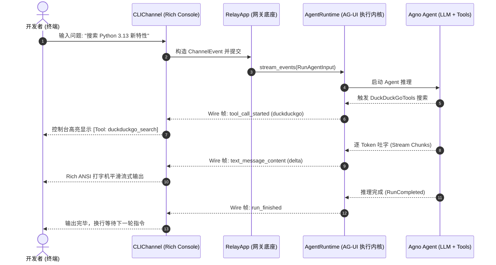

# 01. 纯 CLI 终端智能体（Pure CLI Agent）

这是使用 `agno-harness` 最简单、最快速的起点。**无需公网 IP、无需前端环境、无需申请任何企业机器人凭据**，只需几行代码，即可在本地终端与你的 Agno Agent 展开流畅的打字机流式对话。

---

## 1. 核心架构与交互时序

### 交互时序图（Mermaid Sequence）



- **单一职责**：`AgentRuntime` 负责将 Agent 推理过程编译为 AG-UI 事件流；`RelayApp` 挂载 `CLIChannel` 将其渲染到终端控制台；
- **开箱即用**：支持丰富的终端 Markdown 排版、实时打字机流式渐进显示、以及快捷命令（如 `/reset`）。

---

## 2. 完整实战代码

新建文件 `my_cli_agent.py`：

```python
"""my_cli_agent.py — 纯终端 CLI 极简智能体"""
import os
from agno.agent import Agent
from agno.models.openai import OpenAIChat
from agno.tools.duckduckgo import DuckDuckGoTools
from agno_harness import (
    AgentRuntime,
    CLIChannel,
    RelayApp,
    RelayConfig,
    setup_relay_logging,
)

# 1. 开启终端专业彩色日志服务
setup_relay_logging(level="INFO")

# 2. 定义标准 Agno Agent（完全遵循 Agno 原生开发规范）
# 模型参数只读 AGNO_HARNESS_LLM_*
agent = Agent(
    name="CLI Research Assistant",
    model=OpenAIChat(
        id=RelayConfig.llm_model(default="gpt-4o"),
        base_url=RelayConfig.llm_base_url() or None,
        api_key=RelayConfig.llm_api_key() or None,
    ),
    instructions=[
        "你是一名运行在终端命令行里的全能技术与调研助手。",
        "善用搜索引擎工具回答用户的技术咨询与事实查询。",
        "输出结构分明的 Markdown 格式，代码段标注对应语言。",
    ],
    tools=[DuckDuckGoTools()],
    markdown=True,
)

# 3. 驱动核心执行引擎（标准化 AG-UI 协议事件流）
runtime = AgentRuntime(agent=agent)

# 4. 挂载到全渠道网关 RelayApp 并添加 CLI 终端渠道
relay = RelayApp(runtime=runtime)
cli_channel = CLIChannel()
relay.add_channel(cli_channel)

if __name__ == "__main__":
    import asyncio

    async def main():
        # 启动底层网关并进入交互式命令行循环
        await relay.start()
        try:
            print("\n💡 提示：输入文字即可对话；输入 /reset 清空当前会话历史；按 Ctrl+C 退出。\n")
            await cli_channel.run_interactive_loop(
                chat_id="cli-session",
                sender_id="developer",
            )
        finally:
            await relay.stop()

    asyncio.run(main())
```

---

## 3. 运行与交互体验

执行运行命令：
```bash
uv run python my_cli_agent.py
```

### 体验亮点：
1. **真实打字机流式吐字**：大模型生成的每一个 Token 会在控制台平滑跳出，绝不卡顿或等全句返回才显示；
2. **工具调用彩色提示**：当触发 `DuckDuckGoTools` 时，终端会打印醒目的 `[Tool: duckduckgo_search] (args: ...)` 高亮标签，执行过程一目了然；
3. **会话清空（/reset）**：在交互提示符下直接输入 `/reset`，系统将瞬间重置会话上下文并通知：“Session context cleared. Starting fresh!”。
