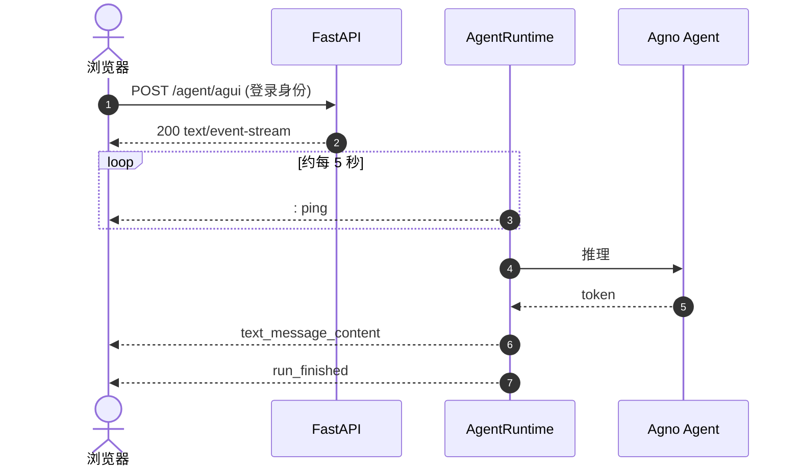

# 02. Web 端与 FastAPI

把 Agent 挂到 FastAPI，浏览器用 SSE 看打字机输出。这一章**只跑通服务**。卡片、`ItemSchema`、侧栏 Todo 后面再接。

产品壳五步：[Web / React](../03-clients/01-web-react/README.md)。

---

## 1. 模型铁律

兼容网关（OpenRouter / DashScope / vLLM）用 `OpenAILike`，不要用官方 OpenAI 语义的 `OpenAIChat`（`developer` role、thinking 对不齐，容易 400）。

`telemetry=False` 必须留：Agno 会在 run 结束后等一段遥测 POST，SSE 假死在收尾。

`num_history_runs=100`：交给压缩器管记忆。写成 `0` 或 `None` 会失忆，见 [压缩 01](../02-interactions/04-compression-and-sealing/01-why-and-num-history.md)。

```python
from agno.models.openai.like import OpenAILike

agent = Agent(
    model=OpenAILike(
        id=RelayConfig.llm_model(default="qwen-plus"),
        api_key=RelayConfig.llm_api_key() or None,
        base_url=RelayConfig.llm_base_url() or None,
    ),
    telemetry=False,
    add_history_to_context=True,
    num_history_runs=100,
    markdown=True,
)
```

---

## 2. 时序



挂上之后有：`POST /agent/agui`、`GET /agent/threads`、`GET /agent/threads/{id}/frames`（配了存储才有）。长任务 `/attach` 见 [Web 04](../03-clients/01-web-react/04-attach-and-longrun.md)。

身份从登录读（cookie / session / `request.state`），不要从 JSON 里读 `userId`。找不到或不是你的 thread 一律 `404`。详见 [02 FastAPI](../01-foundations/02-fastapi-integration.md)。

---

## 3. 最小服务

`web_agent_server.py`：

```python
from fastapi import FastAPI, Request
from fastapi.responses import HTMLResponse
import uvicorn

from agno.agent import Agent
from agno.models.openai.like import OpenAILike
from agno_harness import AgentRuntime, RelayApp, RelayConfig, WebChannel, setup_relay_logging

setup_relay_logging(level="INFO")

agent = Agent(
    name="assistant",
    model=OpenAILike(
        id=RelayConfig.llm_model(default="qwen-plus"),
        api_key=RelayConfig.llm_api_key() or None,
        base_url=RelayConfig.llm_base_url() or None,
    ),
    instructions="用简洁 Markdown 回答。",
    telemetry=False,
    add_history_to_context=True,
    num_history_runs=100,
    markdown=True,
)
runtime = AgentRuntime(agent=agent)
relay = RelayApp(runtime=runtime)
relay.add_channel(WebChannel())

app = FastAPI(lifespan=relay.lifespan)

def resolve_user_id(request: Request) -> str | None:
    return request.headers.get("X-User-Id") or "local-dev"

app.include_router(relay.get_router(prefix="/agent", resolve_user_id=resolve_user_id))


@app.get("/", response_class=HTMLResponse)
async def index():
    return """
    <!DOCTYPE html>
    <html><body style="font-family:sans-serif;max-width:640px;margin:40px auto">
      <h2>SSE 打字机</h2>
      <pre id="log" style="height:280px;overflow:auto;border:1px solid #ccc;padding:12px"></pre>
      <input id="q" value="用三句话介绍 agno-harness" style="width:70%" />
      <button onclick="send()">发送</button>
      <script>
        async function send() {
          const text = document.getElementById('q').value;
          const log = document.getElementById('log');
          log.textContent += "\\n\\n你: " + text + "\\n助手: ";
          const resp = await fetch('/agent/agui', {
            method: 'POST',
            headers: {'Content-Type':'application/json','X-User-Id':'local-dev'},
            body: JSON.stringify({
              threadId: 'web-1', runId: 'run-' + Date.now(),
              messages: [{id:'m1', role:'user', content: text}],
              state: {}, context: [], tools: [], forwardedProps: {}
            })
          });
          const reader = resp.body.getReader();
          const dec = new TextDecoder();
          while (true) {
            const {done, value} = await reader.read();
            if (done) break;
            for (const line of dec.decode(value).split('\\n')) {
              if (!line.startsWith('data: ')) continue;
              try {
                const ev = JSON.parse(line.slice(6));
                if (ev.event === 'text_message_content' || ev.type === 'TEXT_MESSAGE_CONTENT')
                  log.textContent += (ev.delta || ev.content || '');
              } catch (e) {}
            }
            log.scrollTop = log.scrollHeight;
          }
        }
      </script>
    </body></html>
    """

if __name__ == "__main__":
    uvicorn.run("web_agent_server:app", host="0.0.0.0", port=8000, reload=True)
```

```bash
uv run python web_agent_server.py
```

打开 `http://localhost:8000`，点发送：字是一截一截出来的。DevTools 网络里能看到 `: ping`。

这页**不是**产品壳。刷新续写、侧栏、跟滚走 Web 五步。

---

## 4. 做完再加

| 下一步 | 读 |
| --- | --- |
| 产品前端 | [Web 五步](../03-clients/01-web-react/README.md) |
| 装配 Agent（工具、hook、parser） | [07 写一个 Agent](../01-foundations/07-writing-an-agent.md) |
| 卡片 | [01 Class-First](../02-interactions/01-class-first-cards.md) |
| Todo / 长文档 / 压缩 | [03 Todo](../02-interactions/03-todo/README.md) · [08 Artifact](../02-interactions/08-streaming-artifacts.md) · [04 压缩](../02-interactions/04-compression-and-sealing/README.md) |
