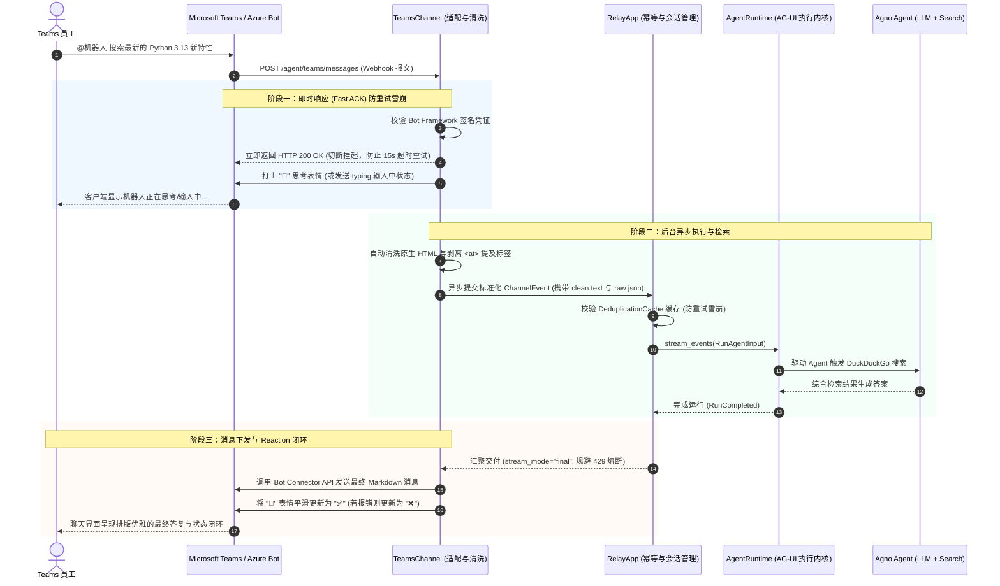

# 03. Microsoft Teams 机器人从向导到完整跑通（Teams Bot Agent）

Microsoft Teams 是跨国企业中使用最广泛的企业协作套件。

本章是 **Teams 机器人的极简上手指南**。我们遵循“最小必要性原则”：**不引入任何多余的卡片与回调概念，仅使用最基础的 Agent + 搜索工具（DuckDuckGo），带领你从向导创建到完整跑通对话！**

---

## 1. 第一步：运行向导生成配置（Onboarding Wizard）

在终端中执行 `agno-harness` 内置的 Teams 向导：
```bash
uv run agno-harness teams onboard
```

向导将在终端中交互式引导你：
1. **Azure Portal 直达链接与步骤**：创建 Azure 机器人服务；
2. **安全最小权限建议（Least Privilege）**：`ChannelMessage.Read.Group`, `ChatMessage.Read`；
3. **输入凭据自动保存**：输入在 Azure 获取的 `App ID` 与 `Client Secret`，向导自动写入本地 `.env` 文件：
   ```env
   AGNO_HARNESS_TEAMS_APP_ID=xxxxxxxx-xxxx-xxxx-xxxx-xxxxxxxxxxxx
   AGNO_HARNESS_TEAMS_APP_PASSWORD=your_azure_client_secret
   ```

同时，该命令会在当前目录生成一份标准的 Teams 应用清单模版 `manifest.json`。

---

## 2. 核心架构与交互时序

### 交互时序图（Mermaid Sequence）



### 底层自动为你解决的 4 大难题：
1. **自动签名校验**：自动解析与校验 Azure Bot Framework 的 JWT 签名；
2. **富文本清洗**：原生 HTML（`<p>`, `<div>`, `<br>`）自动清洗为纯净 Markdown；
3. **提及归一化**：自动去除 `<at>BotName</at>` 标签，避免大模型把 mention 标签当成提问词；
4. **限流熔断防护**：默认采用 `stream_mode="final"` 一次性返回结果，绝不逐 Token 编辑消息。

---

## 3. 完整实战代码（极简最小可用版本）

新建文件 `teams_agent_server.py`：

```python
"""teams_agent_server.py — Microsoft Teams 极简智能体机器人"""
from fastapi import FastAPI
import uvicorn

from agno.agent import Agent
from agno.models.openai import OpenAIChat
from agno.tools.duckduckgo import DuckDuckGoTools
from agno_harness import (
    AgentRuntime,
    RelayApp,
    RelayConfig,
    TeamsChannel,
    setup_relay_logging,
)

# 1. 开启终端专业彩色日志
setup_relay_logging(level="INFO")

# 2. 定义标准 Agno Agent（挂载基础的 DuckDuckGo 搜索工具）
agent = Agent(
    name="Teams Assistant",
    model=OpenAIChat(
        id=RelayConfig.llm_model(default="gpt-4o"),
        base_url=RelayConfig.llm_base_url() or None,
        api_key=RelayConfig.llm_api_key() or None,
    ),
    instructions=[
        "你是一名集成在 Microsoft Teams 中的全能办公与资讯助理。",
        "如果用户提问涉及最新事实、时效性资讯或外部知识，使用 DuckDuckGo 搜索工具获取答案。",
        "使用精炼、专业的中文进行回复，排版使用结构清晰的 Markdown。",
    ],
    tools=[DuckDuckGoTools()],
    markdown=True,
)

# 3. 驱动核心执行引擎（标准化 AG-UI 协议流）
runtime = AgentRuntime(agent=agent)

# 4. 挂载到全渠道网关 RelayApp
# enable_deduplication=True: 拦截大模型搜索耗时较长时，Teams 官方发起的重试请求
relay = RelayApp(runtime=runtime, enable_deduplication=True)

# 5. 添加 Teams 渠道
# 零参数初始化：自动从 .env 读取 AGNO_HARNESS_TEAMS_APP_ID 和 AGNO_HARNESS_TEAMS_APP_PASSWORD
relay.add_channel(TeamsChannel())

# 6. 挂载到企业 FastAPI 服务中
app = FastAPI(title="Teams Agent Service", lifespan=relay.lifespan)

# 挂载 Teams 接收消息的 Webhook 端点
app.include_router(
    relay.get_router(
        prefix="/agent",
        allow_anonymous=True,  # Teams Webhook 请求自带 Bot Framework 签名验证
    )
)

if __name__ == "__main__":
    # 本地启动 HTTP 服务
    uvicorn.run("teams_agent_server:app", host="0.0.0.0", port=8000)
```

---

## 4. 本地公网映射与端到端联调

因为 Teams 官方云端需要向你的服务器发送 HTTP Webhook，在本地调试阶段需配合隧道工具：

### 步骤 A：本地映射公网端口
在另一个终端窗口运行 `ngrok`（或微软官方的 `devtunnel`）：
```bash
ngrok http 8000
# 获得外网 HTTPS 域名，如：https://abc1234.ngrok-free.app
```

### 步骤 B：在 Azure 配置 Messaging Endpoint
登录 [Azure Portal](https://portal.azure.com) -> 进入你的 Azure Bot 资源 -> **Configuration** -> 将 **Messaging endpoint** 填入：
```
https://abc1234.ngrok-free.app/agent/teams/messages
```

### 步骤 C：在 Teams 中发消息实测
1. 打开 Microsoft Teams 客户端，找到已安装的机器人（单聊私信或在群聊中 `@机器人`）；
2. 发送提问：“搜索一下最新的 Python 3.13 有哪些新特性”；
3. **观察控制台日志**：
   - 看到带有 `[TEAMS]` 徽章的收到消息日志；
   - 原始 Teams HTML 格式被自动清洗；
   - Agent 自动调用 `duckduckgo_search` 完成搜索；
4. **客户端体验**：Teams 聊天窗口平滑收到结构整洁、格式优雅的 Markdown 答复，没有 429 报错，没有格式错乱！
