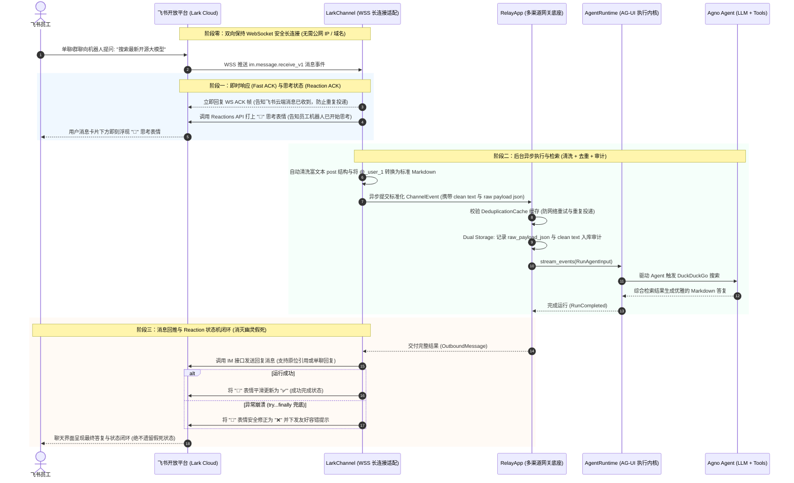

# 04. 飞书 (Lark) 机器人从向导到完整跑通（Lark Bot Agent）

飞书（Feishu / Lark）是先进组织中最主流的即时通讯套件。

本章是 **飞书机器人的极简上手指南**。我们遵循“最小必要性原则”：**不引入任何多余的卡片与回调，仅使用最基础的 Agent + 搜索工具（DuckDuckGo），配合免公网的 WebSocket 长连接，带你从扫码向导到完整跑通！**

---

## 1. 第一步：运行向导与扫码创建（Onboarding Wizard）

在终端中执行：
```bash
uv run agno-harness lark onboard
```

向导将在终端中为你输出：
1. **飞书开放平台应用创建入口**（支持终端 ASCII 二维码扫码或浏览器一键直达）；
2. **严格最小权限建议（Least Privilege）**：
   - `im:message.group_at_msg:readonly`（仅接收群聊中@机器人的消息，保护企业隐私）；
   - `im:message.p2p_msg:readonly`（接收单聊私聊消息）；
3. **推荐订阅的事件**：`im.message.receive_v1`（消息接收事件）；
4. **交互式提取密钥**：输入 App ID 与 App Secret，向导自动写入本地 `.env` 文件：
   ```env
   AGNO_HARNESS_LARK_APP_ID=cli_xxxxxxxxxxxx
   AGNO_HARNESS_LARK_APP_SECRET=xxxxxxxxxxxxxxxxxxxxxxxx
   ```

---

## 2. 核心架构与交互时序

### 交互时序图（Mermaid Sequence）



### 核心亮点与底层保障：
1. **免公网 WebSocket 长连接**：本地电脑直接运行即可接收飞书云端事件，无需内网穿透或备案域名；
2. **即时 Fast ACK 防重发**：长连接帧即时响应 ACK，切断网络超时导致的二次重发；
3. **Reaction 表情状态机闭环**：收到消息打 `👀`，成功打 `✅`，若大模型异常崩溃则通过 `try...finally` 安全修正为 `❌`，绝不遗留幽灵假死状态；
4. **富文本与提及清洗**：自动将飞书嵌套复杂的 `post` JSON 与 `@_user_1` 占位符转为标准 Markdown；
5. **双重审计落库（Dual Storage）**：原始飞书 JSON 报文与清洗后 Markdown 同时留痕入库。

---

## 3. 完整实战代码（极简最小可用版本）

新建文件 `lark_agent_bot.py`：

```python
"""lark_agent_bot.py — 飞书全功能免公网 WebSocket 极简机器人"""
import asyncio

from agno.agent import Agent
from agno.models.openai import OpenAIChat
from agno.tools.duckduckgo import DuckDuckGoTools
from agno_harness import (
    AgentRuntime,
    LarkChannel,
    RelayApp,
    RelayConfig,
    setup_relay_logging,
)

# 1. 开启终端专业彩色日志
setup_relay_logging(level="INFO")

# 2. 定义标准 Agno Agent（挂载基础的 DuckDuckGo 搜索工具）
agent = Agent(
    name="Lark Assistant",
    model=OpenAIChat(
        id=RelayConfig.llm_model(default="gpt-4o"),
        base_url=RelayConfig.llm_base_url() or None,
        api_key=RelayConfig.llm_api_key() or None,
    ),
    instructions=[
        "你是一名集成在企业飞书中的智能办公与全网资讯助理。",
        "如果用户提问需要检索最新事实或外部知识，使用 DuckDuckGo 搜索工具获取答案。",
        "使用精炼、专业的中文进行回复，排版使用优雅的 Markdown 格式。",
    ],
    tools=[DuckDuckGoTools()],
    markdown=True,
)

# 3. 驱动核心执行引擎（标准化 AG-UI 协议流）
runtime = AgentRuntime(agent=agent)

# 4. 挂载到全渠道网关 RelayApp
relay = RelayApp(runtime=runtime, enable_deduplication=True)

# 5. 添加飞书渠道（开启 WebSocket 长连接模式）
# 零参数初始化：自动从 .env 读取 AGNO_HARNESS_LARK_APP_ID 和 AGNO_HARNESS_LARK_APP_SECRET
lark_channel = LarkChannel(use_websocket=True)
relay.add_channel(lark_channel)


if __name__ == "__main__":
    async def main():
        print("🚀 正在通过 WebSocket 建立飞书长连接...")
        await relay.start()
        print("✅ 飞书长连接建立成功！在飞书单聊或群聊中直接向机器人发消息即可体验。\n")
        try:
            # 保持主协程运行
            while True:
                await asyncio.sleep(3600)
        finally:
            await relay.stop()

    asyncio.run(main())
```

---

## 4. 启动与实测

只需在本地终端运行：
```bash
uv run python lark_agent_bot.py
```

### 极速体验：
1. **即刻连通**：看到控制台输出 `✅ 飞书长连接建立成功！`，无需打开任何防火墙端口；
2. **单聊私信测试**：在飞书客户端里搜索并找到你的机器人，私信发送：“搜索一下最新的开源大模型有哪些”；
   - 机器人头像消息下方瞬间打上 `👀`（思考中表情 ACK）；
   - 控制台打印出清晰的 `[LARK]` 日志与搜索工具调用细节；
   - 收到消息：格式排版完美的 Markdown 搜索结果与要点提炼；
   - 消息下方的表情自动平滑替换为 `✅`（已完成）；
3. **群聊测试**：将机器人拉入企业飞书群，在群里 `@机器人 你好`，机器人正常响应，未被 @ 的普通群聊消息则 0 干扰静默忽略。
