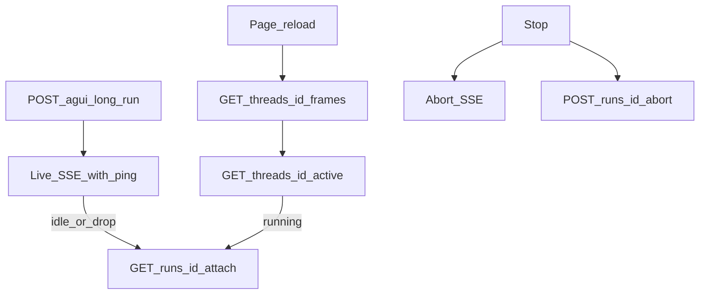

# 04. 刷新续写：attach / cursor / ping / idle

启动先读响应头 `X-Agui-Resume`。不要猜。第一次发送前 `GET /api/v1/health` 返回 `resumeMode`（`none` / `history` / `live`）——缺这个字段，[frontend-kit](../../../../resources/frontend-kit/README_zh.md) 刷新不会 attach。`404` 在 `/api/v1/runs/*` 上表示没挂 `long_runs`。长任务带 `POST /api/v1/channels/web/agui?long-run=1`（兼容 `?detach=1`）。存储职责 → [持久化](../../01-foundations/05-persistence-and-longruns/README.md)。

| | `X-Agui-Resume: none` | `history` | `live` |
| --- | --- | --- | --- |
| 关 tab / 闪退 / 断网 | 连接死了，跑也停 | 后台继续；回来只能看到已写入的帧 | 后台继续；`GET /api/v1/runs/{id}/attach?after=` 接到句中 |
| Stop | abort 这条 HTTP | abort 连接 + `POST /api/v1/runs/{id}/abort` | 同左 |
| 刷新 | 只能看已落盘 | `/frames` 到已写入点 | `/frames` + attach `?after=` |
| 路由 | 无 `/api/v1/runs/*` | 有 | 有 |

关 tab 和闪退 **都不是停任务**。`POST /api/v1/runs/{id}/abort` 只对应 Stop。`AbortController.abort()` 停的是连接；`LongRunManager.abort()` 停的是 run。

## 1. 请叫 attach，不要叫 stream

Canonical：`GET /api/v1/runs/{runId}/attach?after=`

| 名字 | 含义 | 前端怎么用 |
| --- | --- | --- |
| **attach** | 挂回 in-flight / 刚结束的 run，按 SSE 续写 | **唯一要用的路径** |
| `/api/v1/runs/{id}/stream` | deprecated，与 `/attach` 等价 | 勿写新代码 |
| `/api/v1/threads/{id}/frames` | 回放已存展示帧 | 打开/刷新灌历史；**不能**当 live |
| `/api/v1/threads/{id}/messages` | Agno session（lossy） | **不要**当 UI transcript |

两种 cursor **禁止混用**：

| Cursor | 形状 | 只能给 |
| --- | --- | --- |
| attach / SSE `id:` | 单 run log offset（如 `000000000012`） | `GET /api/v1/runs/{id}/attach?after=` 或 `Last-Event-ID` |
| frames | `{runId}:{paddedOffset}` | `GET /api/v1/threads/{id}/frames?after=` |

## 2. 产品必须照做

### A. 本地会话状态

```ts
type SessionCursor = {
  threadId: string;
  runId?: string;
  lastEventId?: string;  // 最近成功 reduce 的 SSE id:（attach cursor）
};
```

- 每收到带 `id:` 的 SSE → 更新 `lastEventId`。
- run **正常结束 / 用户 Stop** → 清掉 `runId`。
- 仅「连接断了但任务可能还在」→ **保留** `runId` + `lastEventId`。

### B. 发送

```ts
await postSse(`${API}/api/v1/channels/web/agui?long-run=1`, runAgentInput, {
  signal: abortController.signal,
  onFrame: (frame) => {
    if (frame.id) lastEventId = frame.id;
    applyEvent(JSON.parse(frame.data));
  },
});
```

`resumeMode === "none"` 时不要发 `long-run`，也不要 idle re-attach。

### C. Wire keepalive + idle re-attach

服务端从第 0 秒起，每约 **5s** 发 SSE comment `: ping\n\n`（不进 `data:` 解析，但**算字节**）。

前端 SSE reader **必须**：

1. 任意网络字节（含只有 `:` 的 comment）→ 重置 idle。
2. 观察到心跳后，idle ≈ **3× 心跳**（约 6–30s；没观察到心跳时退回 ~15s）。
3. 超时 → 可识别的 `AbortError`（如 `cause: "sse-idle"`），**不要**当成用户 Stop。
4. 若 `resumeMode !== "none"` 且非 Stop → 立刻 `GET /api/v1/runs/${runId}/attach?after=${lastEventId}`，同一 reducer。

Stop：

```ts
stopping = true;
abortController.abort();
await fetch(`${API}/api/v1/runs/${runId}/abort`, { method: "POST" });
```

**错法：** 把「没 AG-UI 事件」当死连接；idle 时 abort run；用 `/frames` 的 id 去 attach。

### D. 刷新时序

```text
1. 读 resumeMode
2. 读 localStorage session
3. GET /api/v1/threads/{threadId}/frames
4. 同一 applyEvent 灌进 transcript
5. GET /api/v1/threads/{threadId}/active
6. 若 running：GET /api/v1/runs/{runId}/attach?after={lastEventId}
7. attach 前把 currentId 设回 assistant-${runId}
```

打开已结束的旧会话：做到第 4 步即可。idle 断线续写 ≈ 不做整页重载的第 6 步。



### E. 侧栏合并

`GET /api/v1/threads` 的 `runCount` 给人说话次数；忽略 `messageCount`。当前 active thread 尚未落盘时，本地乐观置顶（见 [02](02-thread-shell.md)）。

### F. 自检清单

- [ ] 新代码只请求 `/attach`
- [ ] frames id 与 attach id 分库存，从不交叉传
- [ ] live / frames / attach 共用一个 `applyEvent`
- [ ] `long-run=1` 与 `resumeMode` 绑定
- [ ] comment 当 keepalive；idle → attach，不是 abort run
- [ ] Stop = 断连接 + `POST .../abort`
- [ ] 刷新：frames → active → attach；结束后清 `runId`
- [ ] 侧栏用 `runCount`
- [ ] 首句发出后刷新：侧栏不丢该会话

闪退：没有 abort、没有 `beforeunload`。下次打开用 localStorage 的 cursor 先 `/frames` 再 attach。会丢进度：`none`；worker 被杀；用户清了站点数据。

必须写进产品逻辑：

1. 同一 thread 同时一个 open run。`start` 对同一 `runId` 幂等。每次 `newId("run")` **不会**停掉已 long-run 的任务。发新消息前看 `/active`。
2. 两种 `after` 不要混。
3. Archive 会把连续 content delta 合成一帧。
4. `unrecordable`：记日志失败不杀流，但 cursor 不再前进。不要向用户保证「一定能 resume」。
5. worker heartbeat 过期的 running 在 attach 时当失败。`404` 且 transcript 已在 = 僵尸 `runId`，清掉即可。
6. `RUN_STARTED` 同 `runId`：reducer 替换同一条 assistant。重连带 `after=`。
7. `RUN_STARTED` 的 `rawEvent.user_input` 与 `/active` 的 `input` 带用户问句。列表里没有就前置用户气泡。
8. `STEP_*` 回放故意不恢复。
9. 两 tab 共享 `threadId+runId` 才幂等 attach；各生成各的 `runId` 就是双跑。
10. 回放后 attach 必须把 `currentId` 挂回 `assistant-${runId}`，否则续传 `TEXT_*` 会被丢掉。
11. `none` 下连接掉了可能没有终态，自己把 `isStreaming=false`。
12. 跨进程 follow 需要 Redis。`memory://` 换 worker 跟不住句中。
13. Stop 后服务端落 `CUSTOM run.cancelled`（`reason: "user_aborted"`）。前端画「已停止生成」，不要红错误卡，也不要标完成。

下一步：[05 收口](05-hitl-cards-devtools.md)。
